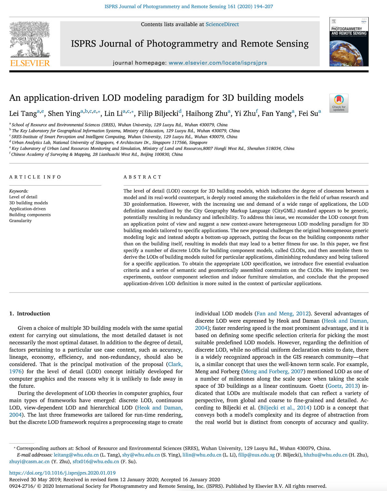



We published a new collaborative [paper](/publication/2020-ijprs-application-lod/):

> Tang L, Ying S, Li L, Biljecki F, Zhu H, Zhu Y, Yang F, Su F (2020): An application-driven LOD modeling paradigm for 3D building models. _ISPRS Journal of Photogrammetry and Remote Sensing_ 161:194-207. [<i class="ai ai-doi-square ai"></i> 10.1016/j.isprsjprs.2020.01.019](https://doi.org/10.1016/j.isprsjprs.2020.01.019) [<i class="far fa-file-pdf"></i> PDF](/publication/2020-ijprs-application-lod/2020-ijprs-application-lod.pdf) <i class="ai ai-open-access-square ai"></i>

The first author is [Lei Tang](https://www.researchgate.net/profile/Lei_Tang29) of Wuhan University.

The level of detail (LOD) concept for 3D building models, which indicates the degree of closeness between a model and its real-world counterpart, is deeply rooted among the stakeholders in the field of urban research and 3D geoinformation. However, with the increasing use and demand of a wide range of applications, the LOD definition standardized by the City Geography Markup Language (CityGML) standard appears to be generic, potentially resulting in redundancy and inflexibility. To address this issue, we reconsider the LOD concept from an application point of view and suggest a new context-aware heterogeneous LOD modeling paradigm for 3D building models tailored to specific applications. The new proposal challenges the original homogeneous generic modeling logic and instead adopts a bottom-up approach, putting the focus on the building components rather than on the building itself, resulting in models that may lead to a better fitness for use. In this paper, we first specify a number of discrete LODs for building component models, called CLODs, and then assemble them to derive the LODs of building models suited for particular applications, diminishing redundancy and being tailored for a specific application. To obtain the appropriate LOD specification, we introduce five essential evaluation criteria and a series of semantic and geometrically assembled constraints on the CLODs. We implement two experiments, outdoor component selection and indoor furniture simulation, and conclude that the proposed application-driven LOD definition is more suited in the context of particular applications.

For more information please see the [paper](/publication/2020-ijprs-application-lod/) (open access <i class="ai ai-open-access-square ai"></i>).

Congratulations to Lei Tang for publishing a part of his PhD research in one of the top journals in the field! :clap: 

[](/publication/2020-ijprs-application-lod/)


BibTeX citation:
```bibtex
@article{2020_ijprs_application_lod,
    author = {Tang, Lei and Ying, Shen and Li, Lin and Biljecki, Filip and Zhu, HaiHong and Zhu, Yi and Yang, Fan and Su, Fei},
    title = {{An application-driven LOD modeling paradigm for 3D building models}},
    journal = {ISPRS Journal of Photogrammetry and Remote Sensing},
    year = {2020},
    volume = {161},
    pages = {194--207},
    doi = {10.1016/j.isprsjprs.2020.01.019}
}
```
