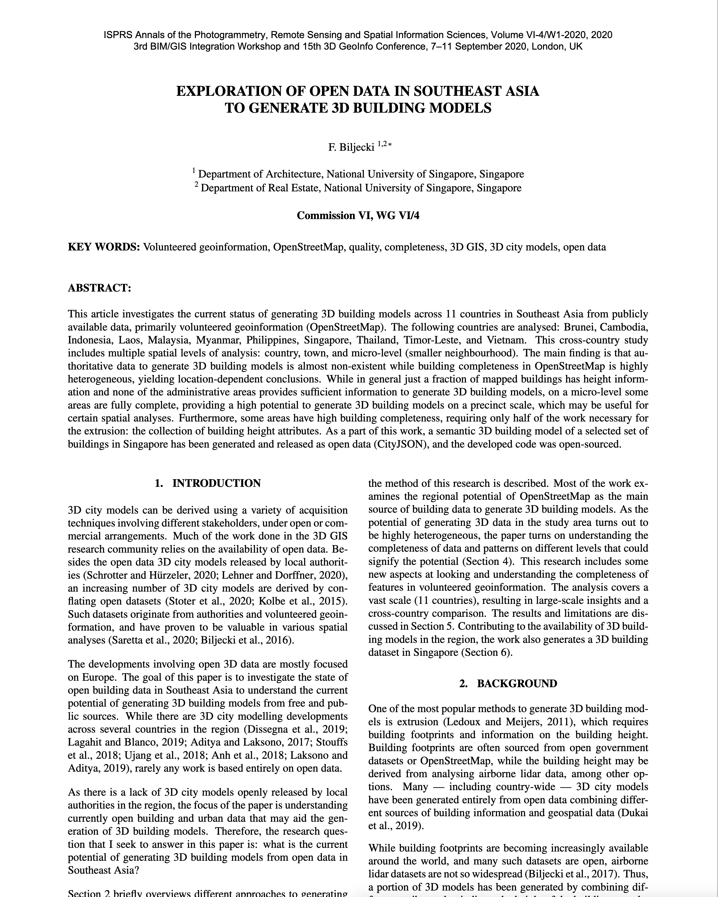



We published a new paper:

> Biljecki F (2020): Exploration of open data in Southeast Asia to generate 3D building models. _ISPRS Annals of Photogrammetry, Remote Sensing and Spatial Information Sciences._ VI-4/W1-2020: 37-44. [<i class="ai ai-doi-square ai"></i> 10.5194/isprs-annals-vi-4-w1-2020-37-2020](https://doi.org/10.5194/isprs-annals-vi-4-w1-2020-37-2020) [<i class="far fa-file-pdf"></i> PDF](/publication/2020-3-dgeoinfo-3-d-asean/2020-3-dgeoinfo-3-d-asean.pdf) <i class="ai ai-open-access-square ai"></i>

This article investigates the current status of generating 3D building models across 11 countries in Southeast Asia from publicly available data, primarily volunteered geoinformation (OpenStreetMap). The following countries are analysed: Brunei, Cambodia, Indonesia, Laos, Malaysia, Myanmar, Philippines, Singapore, Thailand, Timor-Leste, and Vietnam. This cross-country study includes multiple spatial levels of analysis: country, town, and micro-level (smaller neighbourhood). The main finding is that authoritative data to generate 3D building models is almost non-existent while building completeness in OpenStreetMap is highly heterogeneous, yielding location-dependent conclusions. While in general just a fraction of mapped buildings has height information and none of the administrative areas provides sufficient information to generate 3D building models, on a micro-level some areas are fully complete, providing a high potential to generate 3D building models on a precinct scale, which may be useful for certain spatial analyses. Furthermore, some areas have high building completeness, requiring only half of the work necessary for the extrusion: the collection of building height attributes. As a part of this work, a semantic 3D building model of a selected set of buildings in Singapore has been generated and released as open data (CityJSON), and the developed code was open-sourced.

For more information please see the [paper](/publication/2020-3-dgeoinfo-3-d-asean/) (open access <i class="ai ai-open-access-square ai"></i>).

[](/publication/2020-3-dgeoinfo-3-d-asean/)


BibTeX citation:
```bibtex
@article{2020_3dgeoinfo_3d_asean,
 author = {Biljecki, F},
 doi = {10.5194/isprs-annals-vi-4-w1-2020-37-2020},
 journal = {ISPRS Annals of Photogrammetry, Remote Sensing and Spatial Information Sciences},
 pages = {37--44},
 title = {Exploration of open data in Southeast Asia to generate 3D building models},
 volume = {VI-4/W1-2020},
 year = {2020}
}
```


