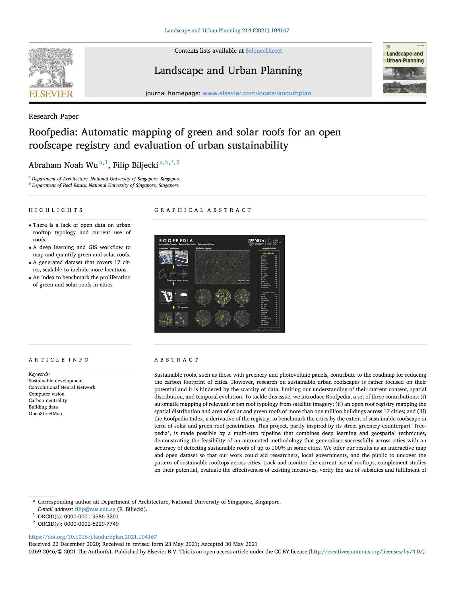

We have a new paper:

> Wu AN, Biljecki F (2021): Roofpedia: Automatic mapping of green and solar roofs for an open roofscape registry and evaluation of urban sustainability. _Landscape and Urban Planning_ 214: 104167, 2021. [<i class="ai ai-doi-square ai"></i> 10.1016/j.landurbplan.2021.104167](https://doi.org/10.1016/j.landurbplan.2021.104167) [<i class="far fa-file-pdf"></i> PDF](/publication/2021-land-roofpedia/2021-land-roofpedia.pdf) <i class="ai ai-open-access-square ai"></i>

In this study, published in _Landscape and Urban Planning_, we have mapped the content of 1 million rooftops in 17 cities around the world, detecting solar panels and greenery, to understand their prevalence in cities.
Through Roofpedia, a research prototype developed thanks to the excellent work of {} (his first paper, in a top journal no less :tada: :clap:), we can obtain insights that may aid in uncovering the pattern of sustainable rooftops, complement studies on their potential, evaluate the effectiveness of existing incentives, verify the use of subsidies and fulfilment of climate pledges, estimate carbon offset capacities of cities, and ultimately support better policies and strategies to increase the adoption of instruments for sustainable development of urban areas.



### Highlights

- There is a lack of open data on urban rooftop typology and current use of roofs.
- A deep learning and GIS workflow to map and quantify green and solar roofs.
- A generated dataset that covers 17 cities, scalable to include more locations.
- An index to benchmark the proliferation of green and solar roofs in cities.


### Abstract

The abstract follows.

> Sustainable roofs, such as those with greenery and photovoltaic panels, contribute to the roadmap for reducing the carbon footprint of cities. However, research on sustainable urban roofscapes is rather focused on their potential and it is hindered by the scarcity of data, limiting our understanding of their current content, spatial distribution, and temporal evolution. To tackle this issue, we introduce Roofpedia, a set of three contributions: (i) automatic mapping of relevant urban roof typology from satellite imagery; (ii) an open roof registry mapping the spatial distribution and area of solar and green roofs of more than one million buildings across 17 cities; and (iii) the Roofpedia Index, a derivative of the registry, to benchmark the cities by the extent of sustainable roofscape in term of solar and green roof penetration. This project, partly inspired by its street greenery counterpart ‘Treepedia’, is made possible by a multi-step pipeline that combines deep learning and geospatial techniques, demonstrating the feasibility of an automated methodology that generalises successfully across cities with an accuracy of detecting sustainable roofs of up to 100% in some cities. We offer our results as an interactive map and open dataset so that our work could aid researchers, local governments, and the public to uncover the pattern of sustainable rooftops across cities, track and monitor the current use of rooftops, complement studies on their potential, evaluate the effectiveness of existing incentives, verify the use of subsidies and fulfilment of climate pledges, estimate carbon offset capacities of cities, and ultimately support better policies and strategies to increase the adoption of instruments contributing to the sustainable development of cities.

### Paper 

For more information, please see the [paper](/publication/2021-land-roofpedia/) (open access <i class="ai ai-open-access-square ai"></i>).

[](/publication/2021-land-roofpedia/)

BibTeX citation:
```bibtex
@article{2021_land_roofpedia,
  author = {Abraham Noah Wu and Filip Biljecki},
  doi = {10.1016/j.landurbplan.2021.104167},
  journal = {Landscape and Urban Planning},
  pages = {104167},
  title = {Roofpedia: Automatic mapping of green and solar roofs for an open roofscape registry and evaluation of urban sustainability},
  url = {https://doi.org/10.1016%2Fj.landurbplan.2021.104167},
  volume = {214},
  year = 2021
}
```


