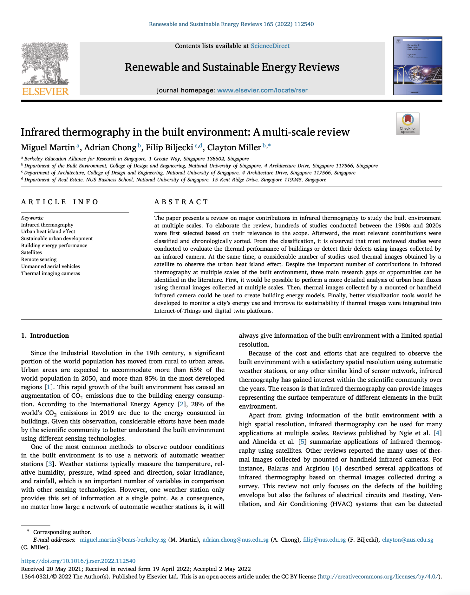

We are glad to share a new collaborative paper in which we were involved:

> Martin M, Chong A, Biljecki F, Miller C (2022): Infrared thermography in the built environment: A multi-scale review. _Renewable and Sustainable Energy Reviews_ 165: 112540. [<i class="ai ai-doi-square ai"></i> 10.1016/j.rser.2022.112540](https://doi.org/10.1016/j.rser.2022.112540) [<i class="far fa-file-pdf"></i> PDF](/publication/2022-rser-thermography-review/2022-rser-thermography-review.pdf)</i> <i class="ai ai-open-access-square ai"></i>

This review paper was led by [Dr Miguel Martin](https://scholar.google.com/citations?user=KngdHq4AAAAJ&hl=en) from the [Berkeley Education Alliance for Research in Singapore](https://bears.berkeley.edu).
Our sister labs --- the [Building and Urban Data Science (BUDS) Lab](https://www.budslab.org) and the [Integrated Data, Energy Analysis + Simulation (IDEAS) Lab](https://ideaslab.io) --- have also been involved.

### Abstract

The abstract follows.

> The paper presents a review on major contributions in infrared thermography to study the built environment at multiple scales. To elaborate the review, hundreds of studies conducted between the 1980s and 2020s were first selected based on their relevance to the scope. Afterward, the most relevant contributions were classified and chronologically sorted. From the classification, it is observed that most reviewed studies were conducted to evaluate the thermal performance of buildings or detect their defects using images collected by an infrared camera. At the same time, a considerable number of studies used thermal images obtained by a satellite to observe the urban heat island effect. Despite the important number of contributions in infrared thermography at multiple scales of the built environment, three main research gaps or opportunities can be identified in the literature. First, it would be possible to perform a more detailed analysis of urban heat fluxes using thermal images collected at multiple scales. Then, thermal images collected by a mounted or handheld infrared camera could be used to create building energy models. Finally, better visualization tools would be developed to monitor a city’s energy use and improve its sustainability if thermal images were integrated into Internet-of-Things and digital twin platforms.

### Paper 

For more information, please see the [paper](/publication/2022-rser-thermography-review/), published open access. <i class="ai ai-open-access-square ai"></i>

[](/publication/2022-rser-thermography-review/)

BibTeX citation:
```bibtex
@article{2022_rser_thermography_review,
  author = {Martin, Miguel and Chong, Adrian and Biljecki, Filip and Miller, Clayton},
  doi = {10.1016/j.rser.2022.112540},
  journal = {Renewable and Sustainable Energy Reviews},
  pages = {112540},
  title = {{Infrared thermography in the built environment: A multi-scale review}},
  volume = {165},
  year = {2022}
}
```


