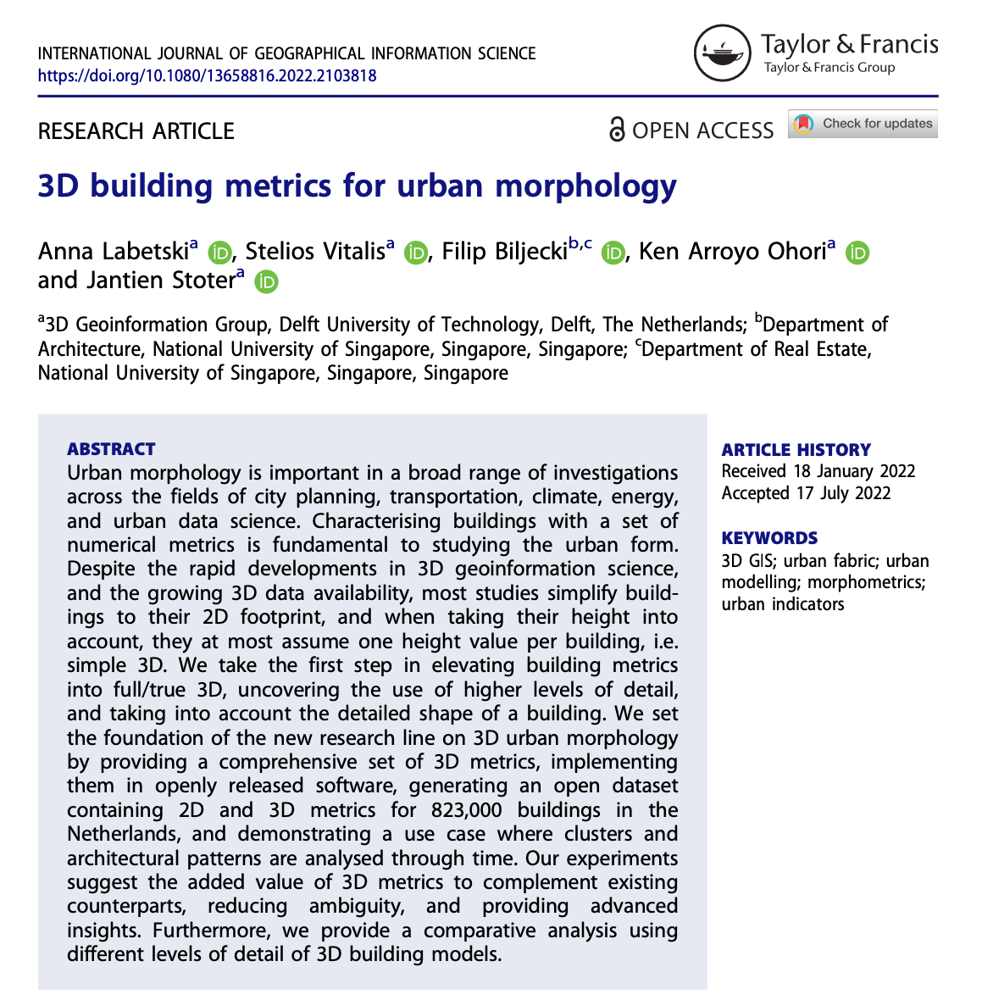

We are glad to share a new collaborative paper in which we were involved:

> Labetski A, Vitalis S, Biljecki F, Arroyo Ohori K, Stoter J (2022): 3D building metrics for urban morphology. _International Journal of Geographical Information Science_. [<i class="ai ai-doi-square ai"></i> 10.1080/13658816.2022.2103818](https://doi.org/10.1080/13658816.2022.2103818) [<i class="far fa-file-pdf"></i> PDF](/publication/2022-ijgis-3-dbm/2022-ijgis-3-dbm.pdf)</i> <i class="ai ai-open-access-square ai"></i>

Congratulations to [Anna Labetski](http://3d.bk.tudelft.nl/alabetski) and [Stelios Vitalis](http://3d.bk.tudelft.nl/svitalis) from the [3D Geoinformation group](https://3d.bk.tudelft.nl) at TU Delft for the publication of their work, and thanks for this productive and exciting collaboration!

The paper introduces an advanced set of 3D metrics to characterise buildings and takes advantage of the increasing availability and detail of 3D building models (related work measures only basic metrics such as the height of buildings and envelope area).
We believe that it sets the scene for truly 3D urban morphology studies.
The software developed is [released open-source](https://github.com/tudelft3d/3d-building-metrics), and the dataset used for the research, containing metrics for 823,000 buildings in the Netherlands, is [released as open data](https://doi.org/10.7910/DVN/6QCRRF).


### Abstract

The abstract follows.

> Urban morphology is important in a broad range of investigations across the fields of city planning, transportation, climate, energy, and urban data science. Characterising buildings with a set of numerical metrics is fundamental to studying the urban form. Despite the rapid developments in 3D geoinformation science, and the growing 3D data availability, most studies simplify buildings to their 2D footprint, and when taking their height into account, they at most assume one height value per building, i.e. simple 3D. We take the first step in elevating building metrics into full/true 3D, uncovering the use of higher levels of detail, and taking into account the detailed shape of a building. We set the foundation of the new research line on 3D urban morphology by providing a comprehensive set of 3D metrics, implementing them in openly released software, generating an open dataset containing 2D and 3D metrics for 823,000 buildings in the Netherlands, and demonstrating a use case where clusters and architectural patterns are analysed through time. Our experiments suggest the added value of 3D metrics to complement existing counterparts, reducing ambiguity, and providing advanced insights. Furthermore, we provide a comparative analysis using different levels of detail of 3D building models.

### Paper 

For more information, please see the [paper](/publication/2022-ijgis-3-dbm/), published as open access. <i class="ai ai-open-access-square ai"></i>

[](/publication/2022-ijgis-3-dbm/)

BibTeX citation:
```bibtex
@article{2022_ijgis_3dbm,
  author = {Labetski, Anna and Vitalis, Stelios and Biljecki, Filip and Arroyo Ohori, Ken and Stoter, Jantien},
  journal = {International Journal of Geographical Information Science},
  title = {3D building metrics for urban morphology},
  year = {2022},
  doi = {10.1080/13658816.2022.2103818}
}
```


