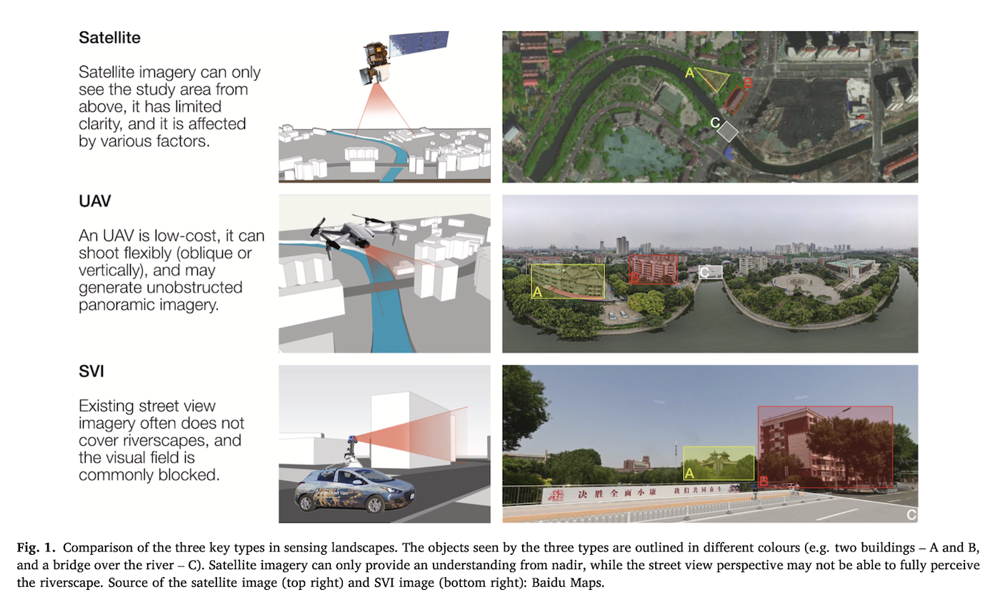
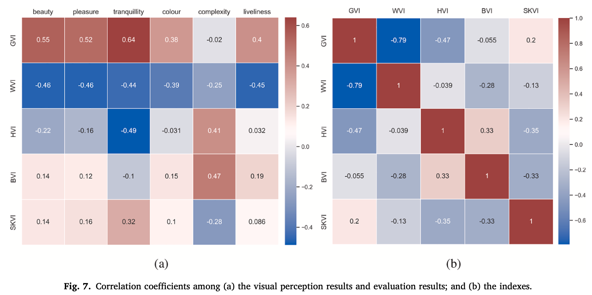
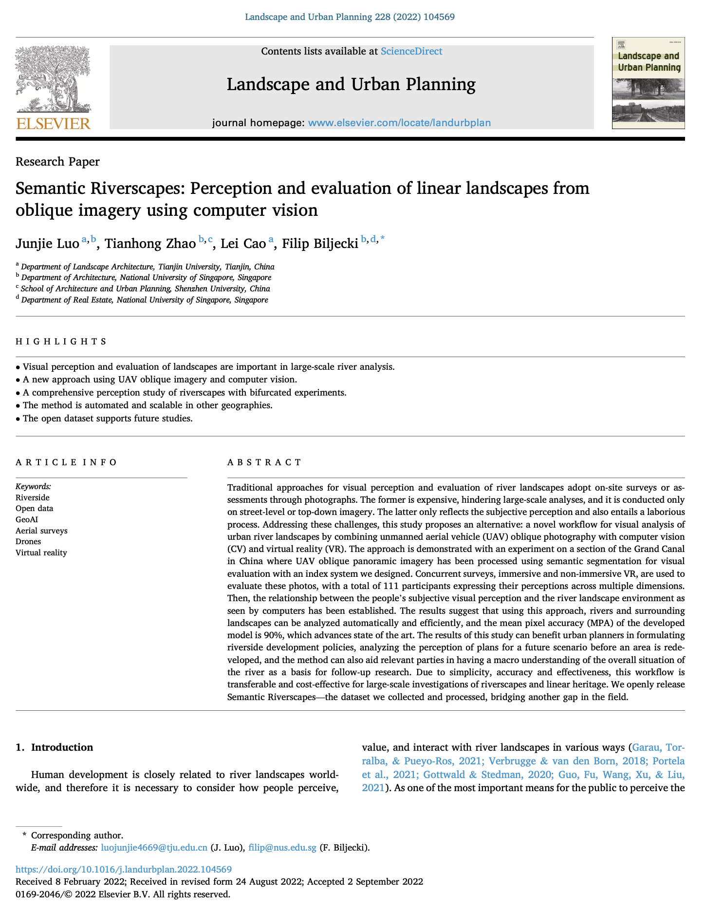

We are glad to share our new paper:

> Luo J, Zhao T, Cao L, Biljecki F (2022): Semantic Riverscapes: Perception and evaluation of linear landscapes from oblique imagery using computer vision. _Landscape and Urban Planning_ 228: 104569. [<i class="ai ai-doi-square ai"></i> 10.1016/j.landurbplan.2022.104569](https://doi.org/10.1016/j.landurbplan.2022.104569) [<i class="far fa-file-pdf"></i> PDF](/publication/2022-land-semantic-riverscapes/2022-land-semantic-riverscapes.pdf)</i>

This research was led by {}.
Congratulations on his first journal paper in our Lab, great job! :raised_hands: :clap:

The work resulted in an open dataset: [Semantic Riverscapes](https://github.com/ualsg/semantic-riverscapes-dataset).



### Highlights

+ Visual perception and evaluation of landscapes are important in large-scale river analysis.
+ A new approach using UAV oblique imagery and computer vision.
+ A comprehensive perception study of riverscapes with bifurcated experiments.
+ The method is automated and scalable in other geographies.
+ The open dataset supports future studies.



### Abstract

The abstract follows.

> Traditional approaches for visual perception and evaluation of river landscapes adopt on-site surveys or assessments through photographs. The former is expensive, hindering large-scale analyses, and it is conducted only on street-level or top-down imagery. The latter only reflects the subjective perception and also entails a laborious process. Addressing these challenges, this study proposes an alternative: a novel workflow for visual analysis of urban river landscapes by combining unmanned aerial vehicle (UAV) oblique photography with computer vision (CV) and virtual reality (VR). The approach is demonstrated with an experiment on a section of the Grand Canal in China where UAV oblique panoramic imagery has been processed using semantic segmentation for visual evaluation with an index system we designed. Concurrent surveys, immersive and non-immersive VR, are used to evaluate these photos, with a total of 111 participants expressing their perceptions across multiple dimensions. Then, the relationship between the people’s subjective visual perception and the river landscape environment as seen by computers has been established. The results suggest that using this approach, rivers and surrounding landscapes can be analyzed automatically and efficiently, and the mean pixel accuracy (MPA) of the developed model is 90%, which advances state of the art. The results of this study can benefit urban planners in formulating riverside development policies, analyzing the perception of plans for a future scenario before an area is redeveloped, and the method can also aid relevant parties in having a macro understanding of the overall situation of the river as a basis for follow-up research. Due to simplicity, accuracy and effectiveness, this workflow is transferable and cost-effective for large-scale investigations of riverscapes and linear heritage. We openly release Semantic Riverscapes—the dataset we collected and processed, bridging another gap in the field.

### Paper 

For more information, please see the [paper](/publication/2022-land-semantic-riverscapes/).

[](/publication/2022-land-semantic-riverscapes/)

BibTeX citation:
```bibtex
@article{2022_land_semantic_riverscapes, 
  year = {2022}, 
  title = {{Semantic Riverscapes: Perception and evaluation of linear landscapes from oblique imagery using computer vision}}, 
  author = {Luo, Junjie and Zhao, Tianhong, and Cao, Lei and Biljecki, Filip}, 
  journal = {Landscape and Urban Planning}, 
  doi = {10.1016/j.landurbplan.2022.104569}, 
  pages = {104569}, 
  volume = {228}
}
```
