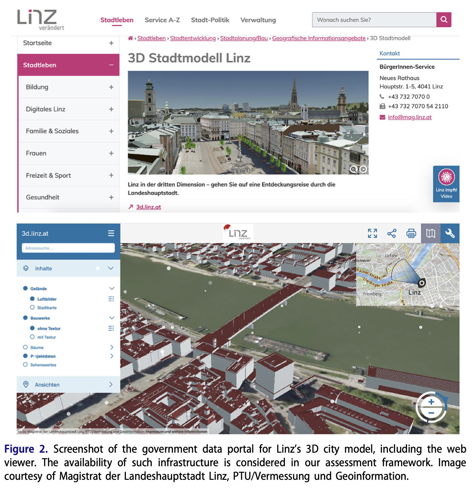

We are glad to share our new paper:

> Lei B, Stouffs R, Biljecki F (2023): Assessing and benchmarking 3D city models. _International Journal of Geographical Information Science_, 37(4): 788-809. [<i class="ai ai-doi-square ai"></i> 10.1080/13658816.2022.2140808](https://doi.org/10.1080/13658816.2022.2140808) [<i class="far fa-file-pdf"></i> PDF](/publication/2023-ijgis-3-d-city-index/2023-ijgis-3-d-city-index.pdf)</i>

This research was led by {}.
Congratulations on her first journal paper! :raised_hands: :clap:

The project has a website: [3D City Index](/project/3d-city-index/).




### Abstract

The abstract follows.

> 3D city models are omnipresent in urban management and simulations. However, instruments for their evaluation have been limited. Furthermore, current instances are scattered worldwide and developed independently, hampering their comparison and understanding practices. While there are developed assessment frameworks in open data, such efforts are generic and not applied to geospatial data. We establish a holistic and comprehensive four-category framework ‘3D City Index’, encompassing 47 criteria to identify key properties of 3D city models, enabling their assessment and benchmarking, and suggesting usability. We evaluate 40 authoritative 3D city models and derive quantitative and qualitative insights. The framework implementation enables a comprehensive and structured understanding of the landscape of semantic 3D geospatial data, as well as doubles as an evaluated collection of open 3D city models. For example, datasets differ substantially in their characteristics, having heterogeneous properties influenced by their different purposes. There are further applications of this first endeavour to standardise the characterisation of 3D data: monitoring developments and trends in 3D city modelling, and enabling researchers and practitioners to find the most appropriate datasets for their needs. The work is designed to measure datasets continuously and can also be applied to other instances in spatial data infrastructures.


### Paper 

For more information, please see the [paper](/publication/2023-ijgis-3-d-city-index/).

[](/publication/2023-ijgis-3-d-city-index/)

BibTeX citation:
```bibtex
@article{2023_ijgis_3d_city_index,
    author = {Lei, Binyu and Stouffs, Rudi and Biljecki, Filip},
    doi = {10.1080/13658816.2022.2140808},
    journal = {International Journal of Geographical Information Science},
    title = {{Assessing and benchmarking 3D city models}},
    year = {2023},
    pages = {788-809},
    volume = {37},
    issue = {4}
}
```
