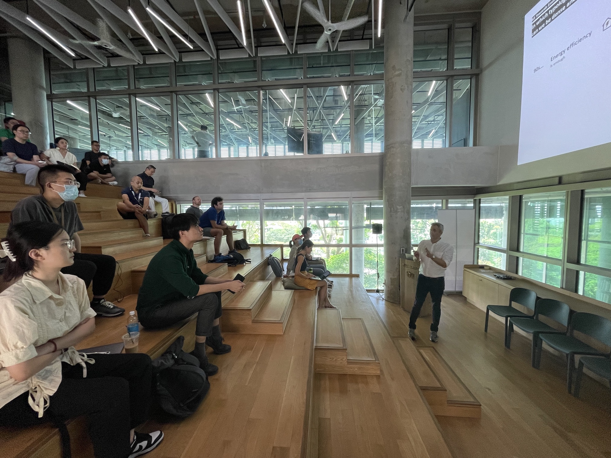
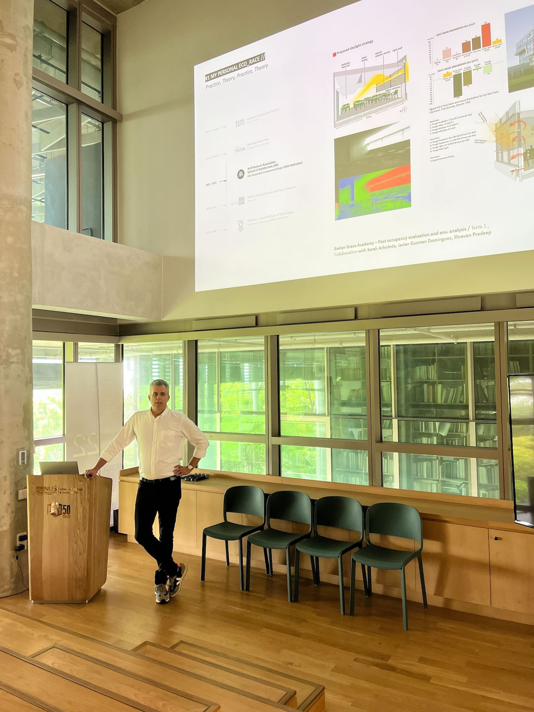

Our Lab and department hosted Dr [Jonathan Natanian](https://jonathann.net.technion.ac.il), assistant professor at the [Faculty of Architecture and Town Planning](https://architecture.technion.ac.il) at [Technion -- Israel Institute of Technology](http://www.technion.ac.il/en/).

At Technion, Jonathan established the [EPDL - Environmental Performance and Design Lab](https://epdl.net.technion.ac.il), a research group that works on bridging the gap between architecture and environmental engineering, and operates by combining three main clusters which together form a triangle of knowledge: data acquisition, computational analysis, and environmental design interface.
EPDL focuses on establishing a bridge between those disciplines in a cross-contextual, multi-scale, and cross-disciplinary way.

During his stay, he delivered the lecture _The Eco-Race in Architecture Caught Between Environmental Intuition and Intelligence_ (poster and abstract below).

Thanks, and looking forward to future collaborations!

> Abstract of the lecture

> The race towards sustainability in the built
> environment is on!

> Zero carbon by 2050 and limiting global warming
> to 1.5 C are just some of the ambitious
> thresholds we need to get to - but how do we
> get there by design?

> Many claim that we should get back to the
> environmental architectural intuition we once had
> - but will it be enough? others push toward fully
> -digitized environmental design workflows - but
> what will happen then?

> This lecture will discuss some of these questions
> which revolve around the gaps between
> environmental intuition and intelligence in
> Architecture from personal, local, and global
> eco-race perspectives.
