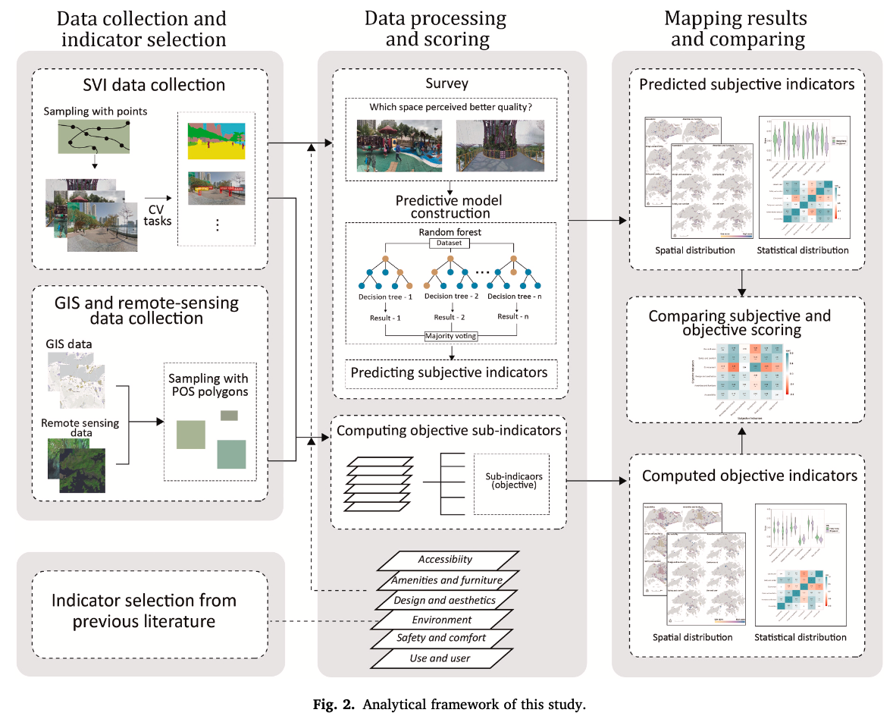
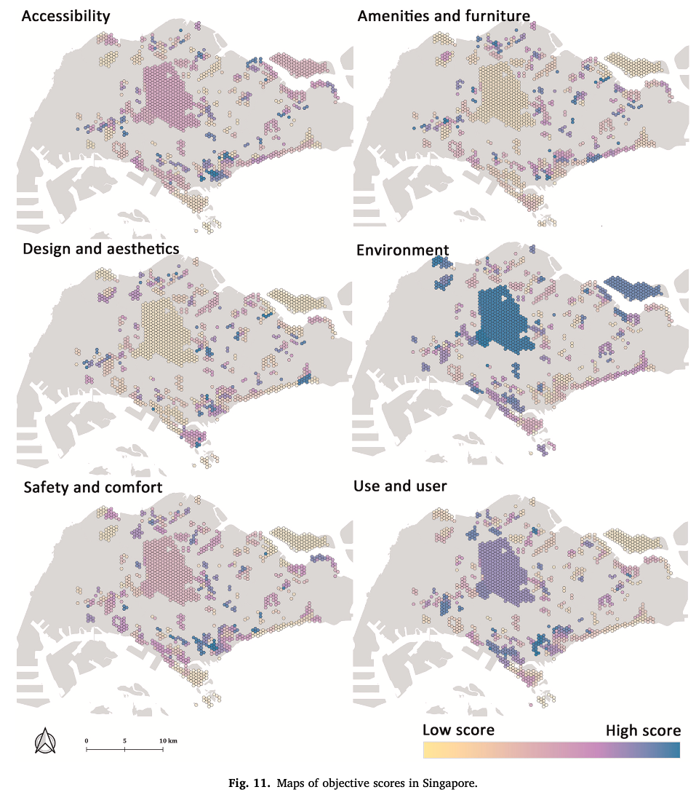
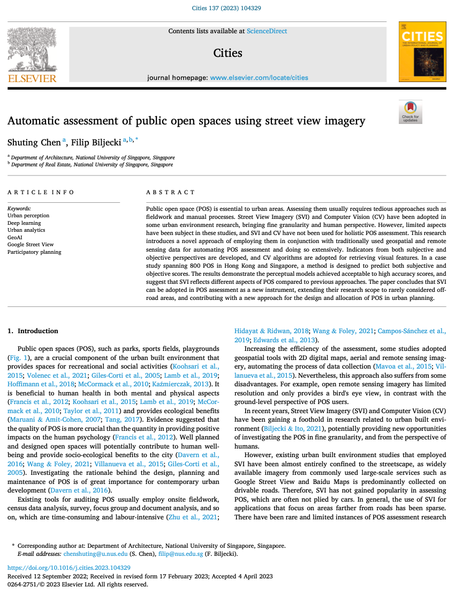

We are glad to share our new paper:

> Chen S, Biljecki F (2023): Automatic assessment of public open spaces using street view imagery. _Cities_ 137: 104329. [<i class="ai ai-doi-square ai"></i> 10.1016/j.cities.2023.104329](https://doi.org/10.1016/j.cities.2023.104329) [<i class="far fa-file-pdf"></i> PDF](/publication/2023-cities-pos/2023-cities-pos.pdf)</i>

This research was led by {}.
Congratulations on the great work and publication! :raised_hands: :clap:
Shuting is now at Hong Kong University, where she started her PhD after graduating from our NUS Master of Urban Planning programme.

Studies using street-level imagery have been confined to driveable roads.
Shuting is among the first ones to take advantage of 'off-road' imagery -- a small but increasing volume of data taken in parks, trails, walkways, etc. to use them to assess public open spaces.
She has developed a new automated method to analyse 800 parks and other types of open spaces in Hong Kong and Singapore.
The findings suggest that such imagery may be instrumental for POS assessment as a new method, extending their research scope to rarely considered off-road areas, and contributing with a new approach for the design and allocation of POS in urban planning.

Until 2023-06-11, the article is available for free via [this link](https://authors.elsevier.com/a/1gywVy5jOr5X7).






### Abstract

The abstract follows.

> Public open space (POS) is essential to urban areas. Assessing them usually requires tedious approaches such as fieldwork and manual processes. Street View Imagery (SVI) and Computer Vision (CV) have been adopted in some urban environment research, bringing fine granularity and human perspective. However, limited aspects have been subject in these studies, and SVI and CV have not been used for holistic POS assessment. This research introduces a novel approach of employing them in conjunction with traditionally used geospatial and remote sensing data for automating POS assessment and doing so extensively. Indicators from both subjective and objective perspectives are developed, and CV algorithms are adopted for retrieving visual features. In a case study spanning 800 POS in Hong Kong and Singapore, a method is designed to predict both subjective and objective scores. The results demonstrate the perceptual models achieved acceptable to high accuracy scores, and suggest that SVI reflects different aspects of POS compared to previous approaches. The paper concludes that SVI can be adopted in POS assessment as a new instrument, extending their research scope to rarely considered off-road areas, and contributing with a new approach for the design and allocation of POS in urban planning.

### Highlights

+ Comprehensive assessment using street view imagery and computer vision.
+ Uncovering the usability of rarely used street-level images beyond streetscapes.
+ Developing and comparing objective and subjective perspectives for assessment.
+ Combination of multi-sourced indicators reduces the bias of single data source.
+ Imagery adds unparalleled insights to traditionally used GIS or remote sensing data.

### Paper 

For more information, please see the [paper](/publication/2023-cities-pos/).

[](/publication/2023-cities-pos/)

BibTeX citation:
```bibtex
@article{2023_cities_pos,
  author = {Shuting Chen and Filip Biljecki},
  doi = {10.1016/j.cities.2023.104329},
  journal = {Cities},
  pages = {104329},
  title = {{Automatic assessment of public open spaces using street view imagery}},
  volume = {137},
  year = {2023}
}
```
