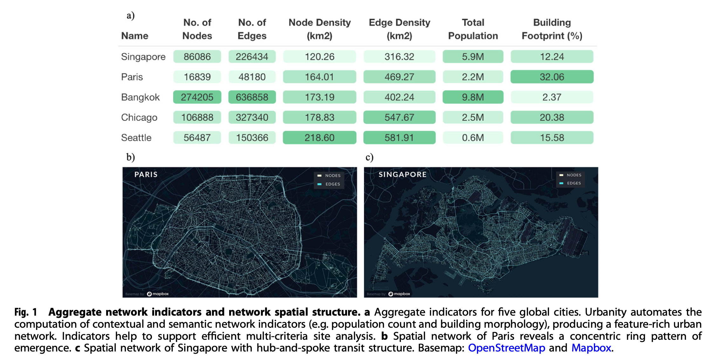
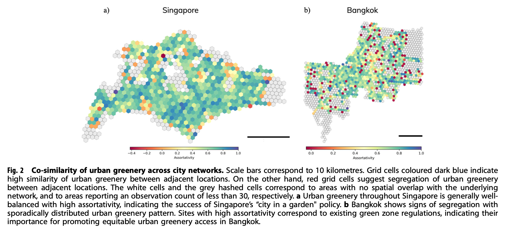
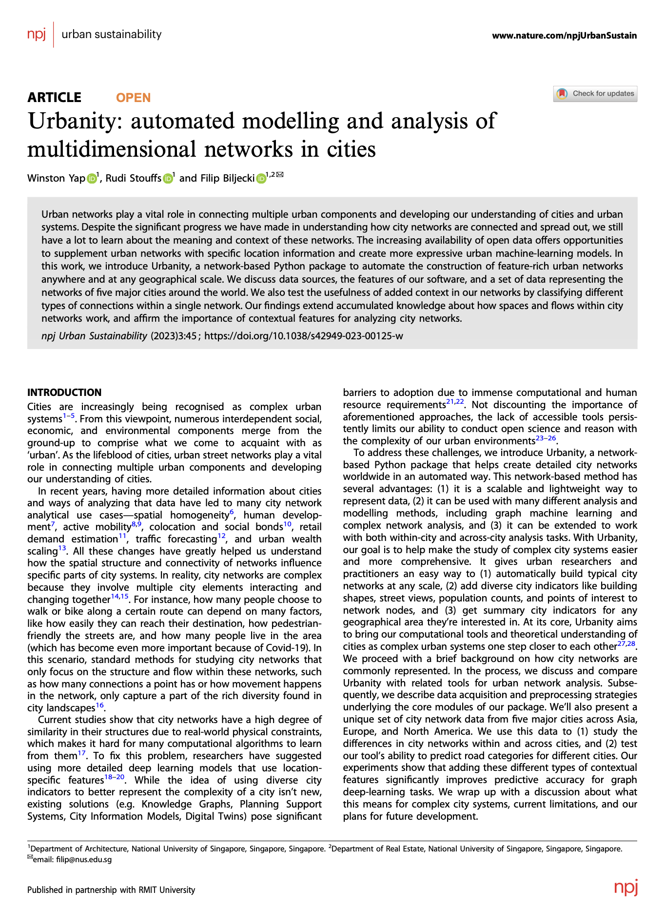

We are glad to share our new paper:

> Yap W, Stouffs R, Biljecki F (2023): Urbanity: automated modelling and analysis of multidimensional networks in cities. npj Urban Sustainability 3: 45. [<i class="ai ai-doi-square ai"></i> 10.1038/s42949-023-00125-w](https://doi.org/10.1038/s42949-023-00125-w) [<i class="far fa-file-pdf"></i> PDF](/publication/2023-npjus-urbanity/2023-npjus-urbanity.pdf)</i> <i class="ai ai-open-access-square ai"></i>

This research was led by {}.
Congratulations on the great work on both the software and publication! :raised_hands: :clap:

Urbanity is a network-based Python package developed by {} at our NUS Urban Analytics Lab to automate the construction of feature rich (contextual and semantic) urban networks at any geographical scale. Through an accessible and simple to use interface, users can request heterogeneous urban information such as street view imagery, building morphology, population (including sub-group), and points of interest for target areas of interest.

Urbanity is designed in an object-oriented approach that parallels the urban planning process. The urban data science pipeline starts with a base map which users can use to explore their site. Subsequently, there are two ways to specify geographical area of interest: 1) drawing with the polygon and box tools provided; or 2) providing your own polygon shapefiles (all common formats .shp/.geojson are supported).

Towards exploring complexities underlying urban systems and facilitating comparative study between cities, Urbanity is developed to facilitate downstream descriptive, modelling, and predictive urban analytical tasks.

The features of Urbanity are as follows:
+ Rapid city-scale network generation
+ Seamless computation of metric, topological, contextual, and semantic network indicators
+ Node and edge spatial context computation
+ Areal statistics for arbitrary urban subzones
+ Validity checks for OpenStreetMap attribute completeness (no. of buildings, percentage with height, percentage with levels, etc.)
+ Primal planar, dual, and spatial graph generation

The code can be found on the [Urbanity's Github repository](https://github.com/winstonyym/urbanity).
The paper is available below.





### Abstract

The abstract follows.

> Urban networks play a vital role in connecting multiple urban components and developing our understanding of cities and urban systems. Despite the significant progress we have made in understanding how city networks are connected and spread out, we still have a lot to learn about the meaning and context of these networks. The increasing availability of open data offers opportunities to supplement urban networks with specific location information and create more expressive urban machine-learning models. In this work, we introduce Urbanity, a network-based Python package to automate the construction of feature-rich urban networks anywhere and at any geographical scale. We discuss data sources, the features of our software, and a set of data representing the networks of five major cities around the world. We also test the usefulness of added context in our networks by classifying different types of connections within a single network. Our findings extend accumulated knowledge about how spaces and flows within city networks work, and affirm the importance of contextual features for analyzing city networks.

### Paper 

For more information, please see the [paper](/publication/2023-npjus-urbanity/) (open access <i class="ai ai-open-access-square ai"></i>).

[](/publication/2023-npjus-urbanity/)

BibTeX citation:
```bibtex
@article{2023_npjus_urbanity,
  author = {Yap, Winston and Stouffs, Rudi and Biljecki, Filip},
  doi = {10.1038/s42949-023-00125-w},
  journal = {npj Urban Sustainability},
  title = {{Urbanity: automated modelling and analysis of multidimensional networks in cities}},
  volume = {3},
  issue = {45},
  year = {2023}
}
```
