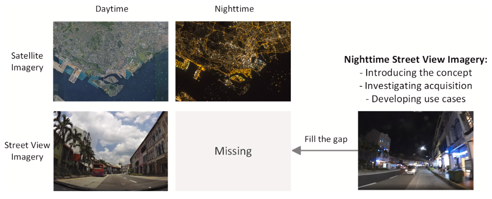
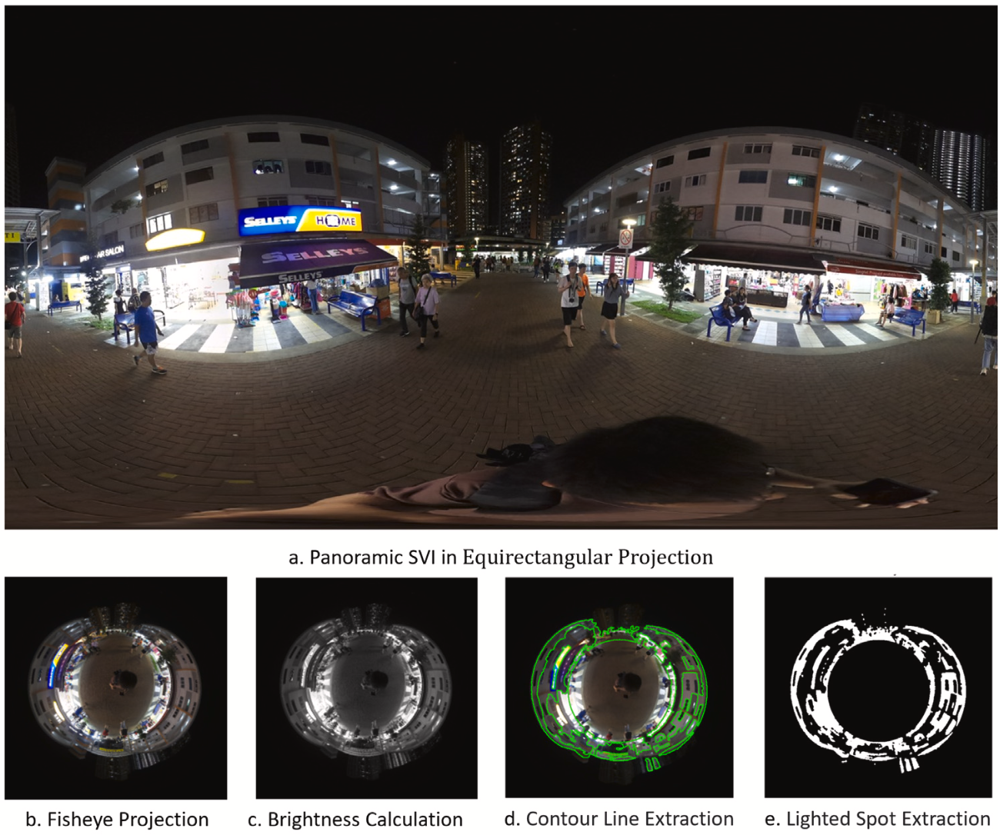
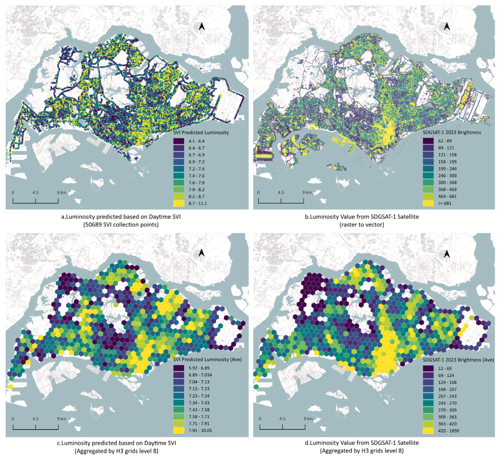
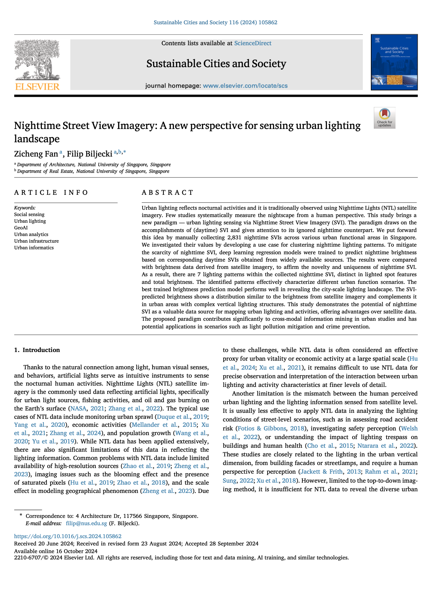

We are glad to share our new paper:

> Fan Z, Biljecki F (2024): Nighttime Street View Imagery: A new perspective for sensing urban lighting landscape. Sustainable Cities and Society, 116: 105862. [<i class="ai ai-doi-square ai"></i> 10.1016/j.scs.2024.105862](https://doi.org/10.1016/j.scs.2024.105862) [<i class="far fa-file-pdf"></i> PDF](/publication/2024-scs-night-svi/2024-scs-night-svi.pdf)</i>

This research was led by {}.
Congratulations on his first PhD journal publication! :raised_hands: :clap:

The dataset has been released openly at [GitHub](https://github.com/fzc961020/Nighttime-SVI).

The paper is [available freely](https://authors.elsevier.com/a/1jy7F7sfVZE4FF) until 2024-12-06.




### Highlights

+ Street View Imagery (SVI) is taken almost exclusively during daytime, ignoring the urban nightscape.
+ Elucidation of data collection and usability of such imagery during night.
+ Exploring the profound correspondence between daytime SVI and nighttime SVI.
+ Identifying nighttime SVI as viable complement for Nighttime Lights satellite imagery.
+ Position that nighttime SVI is a latent but valuable urban dataset.





### Abstract

> Urban lighting reflects nocturnal activities and it is traditionally observed using Nighttime Lights (NTL) satellite imagery. Few studies systematically measure the nightscape from a human perspective. This study brings a new paradigm — urban lighting sensing via Nighttime Street View Imagery (SVI). The paradigm draws on the accomplishments of (daytime) SVI and gives attention to its ignored nighttime counterpart. We put forward this idea by manually collecting 2,831 nighttime SVIs across various urban functional areas in Singapore. We investigated their values by developing a use case for clustering nighttime lighting patterns. To mitigate the scarcity of nighttime SVI, deep learning regression models were trained to predict nighttime brightness based on corresponding daytime SVIs obtained from widely available sources. The results were compared with brightness data derived from satellite imagery, to affirm the novelty and uniqueness of nighttime SVI. As a result, there are 7 lighting patterns within the collected nighttime SVI, distinct in lighted spot features and total brightness. The identified patterns effectively characterize different urban function scenarios. The best trained brightness prediction model performs well in revealing the city-scale lighting landscape. The SVI-predicted brightness shows a distribution similar to the brightness from satellite imagery and complements it in urban areas with complex vertical lighting structures. This study demonstrates the potential of nighttime SVI as a valuable data source for mapping urban lighting and activities, offering advantages over satellite data. The proposed paradigm contributes significantly to cross-modal information mining in urban studies and has potential applications in scenarios such as light pollution mitigation and crime prevention.




### Paper 

For more information, please see the [paper](/publication/2024-scs-night-svi/).

[](/publication/2024-scs-night-svi/)

BibTeX citation:
```bibtex
@article{2024_scs_nightSVI,
 author = {Fan, Zicheng and Biljecki, Filip},
 doi = {10.1016/j.scs.2024.105862},
 journal = {Sustainable Cities and Society},
 pages = {105862},
 title = {Nighttime Street View Imagery: A new perspective for sensing urban lighting landscape},
 volume = {116},
 year = {2024}
}
```
