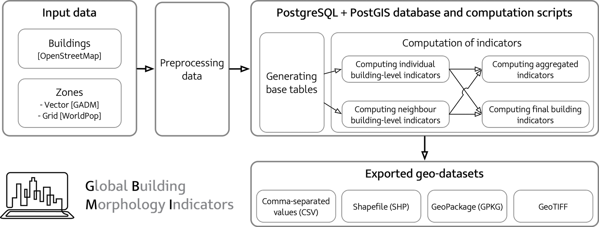
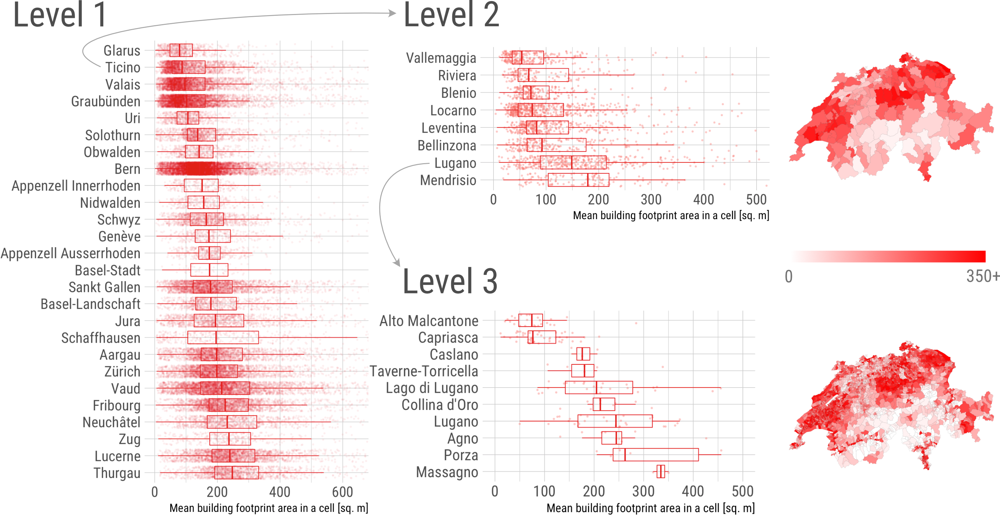
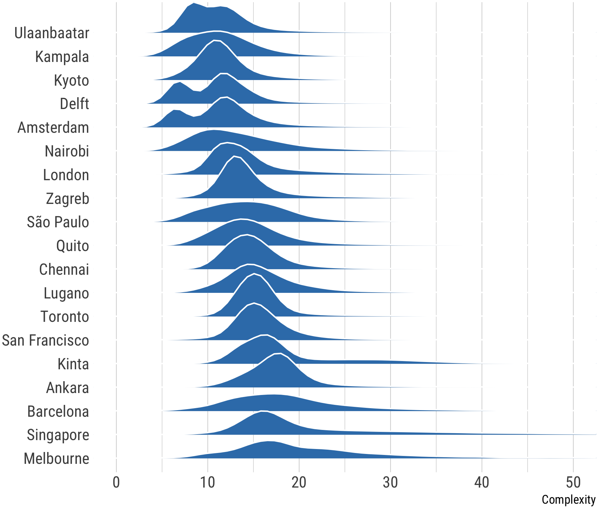

## GBMI --- Understanding the building form around the world in detail

### Our triplex project: metrics, open-source software, and open dataset

Characterising and analysing urban morphology is a continuous task in urban data science, environmental analyses, and many other domains. As the availability and quality of data on them have been increasing, buildings have gained more attention. However, tools and data facilitating large-scale studies, together with an interdisciplinary consensus on metrics, remain scarce and often inadequate. We present Global Building Morphology Indicators (GBMI) — a three-pronged contribution addressing such shortcomings:

1. a comprehensive list of hundreds of building form multi-scale measures derived through a systematic literature review;
1. a methodology and tool for the computation of these metrics in a database suited for big data and comparative studies, and release the code freely and open-source; and
1. we carry out the computations using high performance computing, generating a public repository with data quantifying the form of selected urban areas around the world, and demonstrate their value with novel analyses comparing morphological parameters across cities.

GBMI introduces a formalised, structured, modular, and extensible method to compute, manage, and disseminate urban indicators at a large scale and high resolution, while the precomputed dataset facilitates comparative studies. The theory and implementation traverse multiple scales: at the building level, both individual and contextual ones based on encircling buildings by multiple buffers, and aggregations at several hierarchical administrative levels and at multiple grids. Our open dataset, comprising billions of records on a growing scope of urban areas worldwide, is the most comprehensive instance of morphological data parametrising the individual building stock, supporting studies in urban analytics and a range of disciplines.

The nature of our project is open --- data and code are released openly, and the project is modular, enabling the addition of new geographies and indicators.
Further, the paper has been published as [an open access publication](https://doi.org/10.1016/j.compenvurbsys.2022.101809) .

## Paper and attribution

A [paper](https://doi.org/10.1016/j.compenvurbsys.2022.101809) describing the project, and from which the description above was adopted, was published in _Computers, Environment and Urban Systems_.
Please refer to the paper for detailed information, while this website summarises the project and provides the links to the datasets and code.

If you use GBMI in a scientific context, please cite the paper:

> Biljecki F, Chow YS (2022): Global Building Morphology Indicators. Computers, Environment and Urban Systems 95: 101809.


```bibtex
@article{2022_ceus_gbmi,
 author = {Biljecki, Filip and Chow, Yoong Shin},
 doi = {10.1016/j.compenvurbsys.2022.101809},
 journal = {Computers, Environment and Urban Systems},
 pages = {101809},
 title = {Global Building Morphology Indicators},
 volume = {95},
 year = {2022}
}
```


## Part 1: Metrics

Despite the omnipresence of urban morphology analyses, especially in domains such as urban microclimate, there is no consensus on the metrics. 
Based on a systematic review, we put together a structured list of hundreds of indicators that are commonly used to describe the built form quantitatively. 
Please see the [paper](https://doi.org/10.1016/j.compenvurbsys.2022.101809) for more information about the approach and comprehensive list.


## Part 2: Software

A pillar of our work is a tool for computing these building metrics.
The [tool](https://github.com/ualsg/global-building-morphology-indicators), released open-source, is implemented in a database, facilitating large-scale and big data analyses.



## Part 3: Dataset

We ran the tool on selected cities and countries around the world (based on OpenStreetMap) and produced a series of open datasets.
Their download links are listed at the website at different hierarchical levels (e.g. building and grid level).
Please go to the [GBMI Data Repository](https://dataverse.harvard.edu/dataverse/gbmi) to explore more.
For more details about the structure, please refer to the [paper](https://doi.org/10.1016/j.compenvurbsys.2022.101809).

Here are some insights in the produced datasets.

 OpenStreetMap contributors, GADM.")





## Demo/Analysis

Analyses taking advantage of numerical indicators parametrising the built form are numerous, as elaborated in the [paper](https://doi.org/10.1016/j.compenvurbsys.2022.101809), which also contains some examples of using our own dataset for analyses.



We look forward to seeing what others will come up with.

## Licence

All aspects of the project are licenced according to [CC BY 4.0](https://creativecommons.org/licenses/by/4.0/).
That means that you can use our work for pretty much anything as long as you attribute it (i.e. cite our [paper](https://doi.org/10.1016/j.compenvurbsys.2022.101809) above).
The [paper](https://doi.org/10.1016/j.compenvurbsys.2022.101809) has been released under the same licence and it is open access.

## Limitations, issues, and future work

Like any other academic software, GBMI is an experimental research prototype, which leaves some opportunity for improvement and future work.
For example, computing the contextual indicators for large dense urban areas may take time and we are looking into enhancing this process. 
Further, input datasets will directly influence the accuracy of the results.
While OpenStreetMap provides excellent data for many urban areas, on the other hand, some are heterogeneous in quality with errors that may propagate to the generated dataset.

## People

### Development (software, data)
{}

### Research (metrics, analysis) & principal investigator
{}

### Research group
[Urban Analytics Lab](/), National University of Singapore (NUS)

## Acknowledgements

GBMI is made possible by the efforts of many others, primarily developers of PostgreSQL/PostGIS and the OpenStreetMap community.

This research is part of the project Large-scale 3D Geospatial Data for Urban Analytics, which is supported by the National University of Singapore under the Start Up Grant R-295-000-171-133 and by the AWS Cloud Credits for Research.

The illustrations of the metrics are made by our awesome designer {}.

For more information, please see the aforementioned [paper](https://doi.org/10.1016/j.compenvurbsys.2022.101809).
