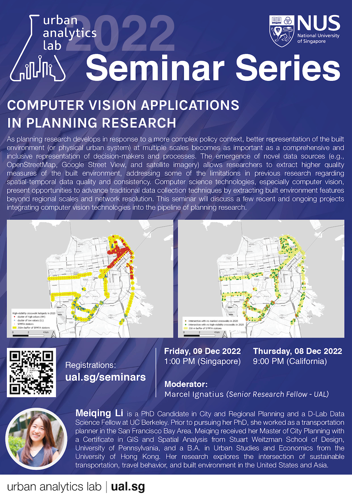
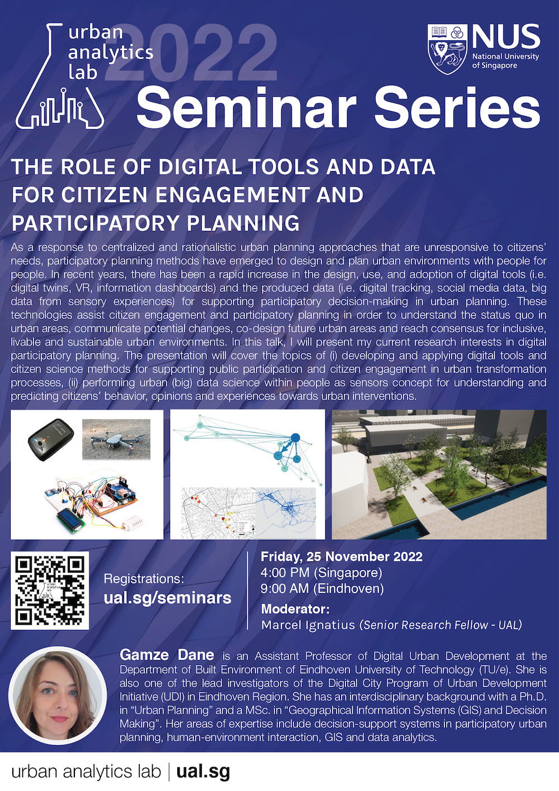
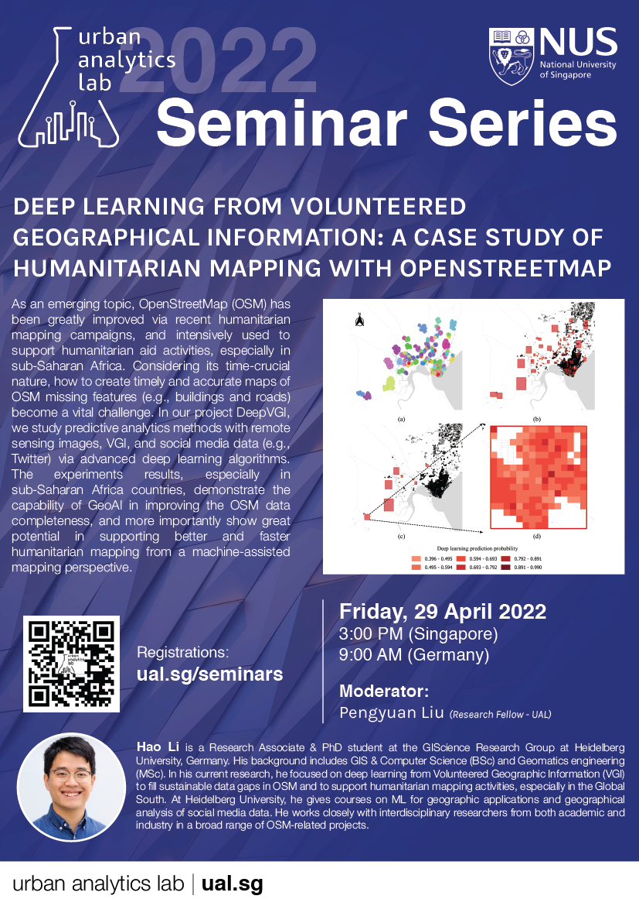

The Urban Analytics Lab seminar series is part of our community engagement and to provide a platform leading to interesting discussions, new ideas, and spurring collaborations. 
In our seminar series, we give priority to early career researchers.
The seminars are by invitation.
The series is managed by Dr {}.

---

### 2023-01-03 --- Addressing the Urban Planning Challenges Using GeoAI

By [Vaibhav Kumar](https://sites.google.com/view/vaibhavkumar1/home),
[Department of Data Science and Engineering](https://dse.iiserb.ac.in),
[Indian Institute of Science Education and Research Bhopal](https://www.iiserb.ac.in),
India

The world is witnessing tremendous planned and unplanned urban growth. More than 50% of the population will reside in urban centres in the next decade. The existing cities are witnessing a lot of challenges in many areas such as housing, health, climate, disaster, and transportation, to name a few. If not addressed now, these challenges will be even more pragmatic in the coming future, especially in the urban centers of developing countries. Geospatial Artificial Intelligence (GeoAI), which combines spatial data with artificial intelligence offers unique solutions to various urban issues. This talk aims to cover studies from GeoAI Research Lab, IISER Bhopal, which aim to solve multiple urban planning problems such as transportation, waste management, safety, disaster management, quality of life, etc.

---

### 2022-12-09 --- Computer Vision Applications in Planning Research

By [Meiqing Li](http://meiqingli.com),
[College of Environmental Design](https://ced.berkeley.edu),
[University of California, Berkeley](https://www.berkeley.edu),
USA

As planning research develops in response to a more complex policy context, better representation of the built environment (or physical urban system) at multiple scales becomes as important as a comprehensive and inclusive representation of decision-makers and processes. The emergence of novel data sources (e.g., OpenStreetMap, Google Street View, and satellite imagery) allows researchers to extract higher quality measures of the built environment, addressing some of the limitations in previous research regarding spatial-temporal data quality and consistency. Computer science technologies, especially computer vision, present opportunities to advance traditional data collection techniques by extracting built environment features beyond regional scales and network resolution. This seminar will discuss a few recent and ongoing projects integrating computer vision technologies into the pipeline of planning research. 

---

### 2022-11-25 --- The role of digital tools and data for citizen engagement and participatory planning

By [Gamze Dane](https://gamzedane.com),
[Department of Built Environment](https://www.tue.nl/en/our-university/departments/built-environment/),
[Eindhoven University of Technology](https://www.tue.nl/en/),
& Digital City Program at the [Urban Development Initiative](https://brainporteindhoven.com/udi/en/),
the Netherlands

As a response to centralized and rationalistic urban planning approaches that are unresponsive to citizens’ needs, participatory planning methods have emerged to design and plan urban environments with people for people. In recent years, there has been a rapid increase in the design, use, and adoption of digital tools (i.e. digital twins, VR, information dashboards) and the produced data (i.e. digital tracking, social media data, big data from sensory experiences) for supporting participatory decision-making in urban planning. These technologies assist citizen engagement and participatory planning in order to understand the status quo in urban areas, communicate potential changes, co-design future urban areas and reach consensus for inclusive, livable and sustainable urban environments. In this talk, I will present my current research interests in digital participatory planning. The presentation will cover the topics of (i) developing and applying digital tools and citizen science methods for supporting public participation and citizen engagement in urban transformation processes, (ii) performing urban (big) data science within people as sensors concept for understanding and predicting citizens’ behavior, opinions and experiences towards urban interventions.

---

### 2022-08-29 --- Sinagpala: Assessing Rooftop Solar Energy Potential on a Building-level Scale in an Urban Environment

By
[Unisse Chua](https://unissechua.github.io),
[Center for Complexity and Emerging Technologies](https://comet.dlsu.edu.ph),
[College of Computer Studies](https://www.dlsu.edu.ph/colleges/ccs/),
[De La Salle University](https://www.dlsu.edu.ph/),
the Philippines

The Philippines has committed to transitioning into a low-carbon future by reducing coal-fired generation and increasing the share of renewable energy sources such as solar power. However, there is a lack of solar energy potential estimators in the Philippine context which makes it difficult to assess the feasibility of using solar photovoltaics in a given area. Urban environments pose a strong potential in significantly reducing overall reliance on fossil fuel energy as their density takes up a big portion of the energy consumption. Various studies have assessed the solar energy potential and were able to acquire substantial results. However, few studies have considered the context where an area has limited to no access to expensive, but reliable, data such as light detecting and ranging (LiDAR). In this talk, we propose using readily available satellite images to be fed into a convolutional neural network (CNN) for rooftop segmentation which will then be used along with meteorological data, through theoretical computations, to estimate the solar energy potential of buildings in an urban environment.

---

### 2022-07-28 --- Open Computational Design for Sustainable Developments (in person at NUS + online)

By
[Kian Wee Chen](https://acee.princeton.edu/people-directory/kian-wee-chen/),
[CHAOS Lab](https://chaos.princeton.edu),
[Andlinger Center for Energy and the Environment](https://acee.princeton.edu),
Princeton University,
USA

Computational design uses computational technologies to support and enhance the design process. It requires designers to systematically assess the design process to apply the appropriate technologies in a timely and effective manner. Computational design offers new opportunities to design better built environments. It promises a seamless built-virtual-built cycle where designers are able to design virtually, translate the design to built artefact using digital fabrications, then again capture and represent the artefact virtually with sensors and reality capture technologies for refinement. This cycle allows designers to refine their designs relatively cheaply and rapidly. It is a powerful tool for the design of sustainable developments, where designers are able to meaningfully evaluate their designs throughout the design process.
Open computational design will significantly reduce the cost of technology adoption in practice and especially in places that cannot afford technologies. They are coincidentally located in the regions where rapid urbanization is taking place. I hope to encourage designers to share their design process openly for others to build upon. As new improvements are made, the industry and society stands to gain as we improve the way we design our built environment. This is only possible with the use of open-source technologies where everyone can contribute and modify the computational design process to suit their own needs. In this talk, I will present my current research interest on supporting open computational design through drawing lessons from my previous research and teaching works that have used open-source computational technologies.

---

### 2022-07-22 --- Factor Analysis and Spatial Prediction: New Methods and Tools

By
[Yongze Song](https://yongzesong.com),
[School of Design and the Built Environment](https://about.curtin.edu.au/learning-teaching/humanities/design-built-environment/),
Curtin University,
Australia

The spatial analysis demonstrates the value of location information in the Earth and urban data-driven studies. The spatial analysis provides solutions for identifying geospatial objects and events, investigating inequality, exploring spatial factors, and predicting spatial scenarios. I will introduce new methods and tools for factor analysis and spatial prediction in this seminar. First, we developed a series of advanced spatial models for characterising stratified heterogeneity and exploring the contributions of factors and spatially interactions of factors. For instance, I developed a GD R software package for Optimal Parameters-based Geographical Detector (OPGD) models attracting more than 30,000 downloads and over 60 citations. In addition, I proposed the concept of Second-Dimension Spatial Association (SDA) and developed models and computation tools. SDA examines spatial association by extracting more information about the geographical environment outside sampling locations. SDA models provide accurate, smooth, effective, and low-uncertainty spatial predictions. The new methods and tools generate more opportunities for spatial analysis and the implementation of Earth and urban data.

---

### 2022-04-29 --- Deep learning from Volunteered Geographical Information: a case study of humanitarian mapping with OpenStreetMap

By
[Hao Li](https://bobleegogogo.github.io),
[GIScience Research Group](https://www.geog.uni-heidelberg.de/gis/index_en.html),
Heidelberg University,
Germany

As an emerging topic, OpenStreetMap (OSM) has been greatly improved via recent humanitarian mapping campaigns, and intensively used to support humanitarian aid activities, especially in sub-Saharan Africa. Considering its time-crucial nature, how to create timely and accurate maps of OSM missing features (e.g., buildings and roads) become a vital challenge. In our project DeepVGI, we study predictive analytics methods with remote sensing images, VGI, and social media data (e.g., Twitter) via advanced deep learning algorithms. The experiments results, especially in sub-Saharan Africa countries, demonstrate the capability of GeoAI in improving the OSM data completeness, and more importantly show great potential in supporting better and faster humanitarian mapping from a machine-assisted mapping perspective.

---

### 2022-04-08 --- Using nature's contribution to people (NCP) to inform decision-making

By
[Sergio Wicki](https://irl.ethz.ch/people/person-detail.MTY4ODA4.TGlzdC8xNzM4LC0xMzk1OTgzMDM3.html),
[Planning of Landscape and Urban Systems](https://plus.ethz.ch),
ETH Zurich,
Switzerland

In many cities around the world. Nature's Contribution to People (NCP) are under pressure.
With a growing urban population, the pressure on NCPs in the remaining open spaces increases.
The planning of new residential areas to accommodate urban dwellers increasingly requires the consideration of NCPs, especially when taking into account the irreversibility of urban development.
In a compact and land-scarce city like Singapore, the allocation of new residential areas poses a major challenge of high complexity.
Designed to operationalize and solve such complex problems, optimization procedures can identify trade-offs between multiple objectives by displaying the optimal solutions in a so-called trade-off curve.
A solution is considered optimal if an objective cannot be improved, without reducing another objectve.
Furthermore, multi-objective optimizations allow the integration of various perspectives of stakeholders into the modeling process, making them well-suited to be integrated in participatory approaches.

---

### 2022-03-11 --- 3D building metrics for urban morphology

By [Anna Labetski](http://3d.bk.tudelft.nl/alabetski) and [Stelios Vitalis](http://3d.bk.tudelft.nl/svitalis),
[3D Geoinformation group](https://3d.bk.tudelft.nl),
Delft University of Technology,
the Netherlands

The study of urban morphology is a well established field for
understanding the impact and the management of the urban form and
the built environment which is useful in many different applications. While
there have been a plethora of studies in 2D, there have been very little in
3D, of which a vast majority are not in fact true 3D and rather 2.5D. Our
work aims to project urban morphology analysis to true 3D. This work is
driven in large part due to the availability of open 3D city models as well
as new 3D Python libraries. In our presentation we will examine 3D urban
morphology metrics, the process of moving from 2D to 3D, difficulties in
working with 3D data, and applications that can benefit from this
analvsis.

