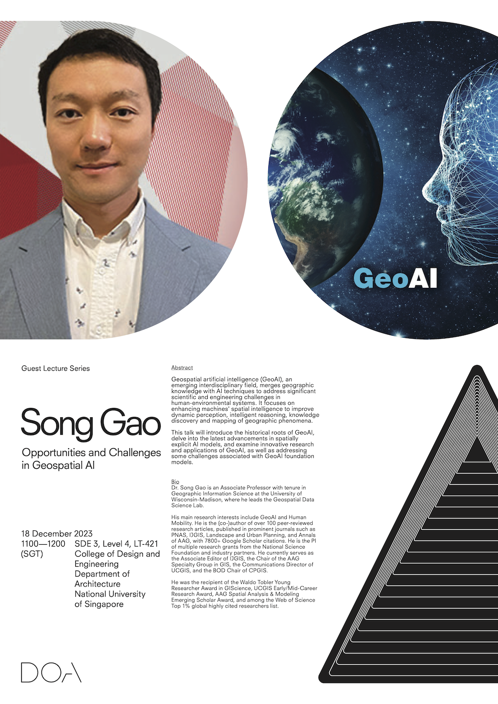
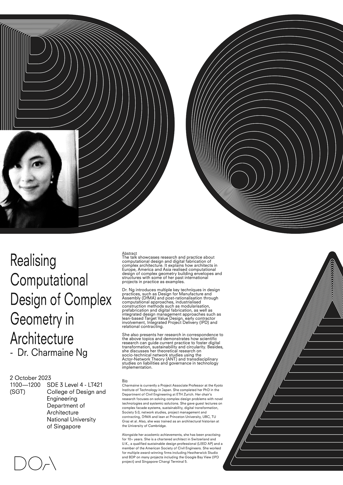
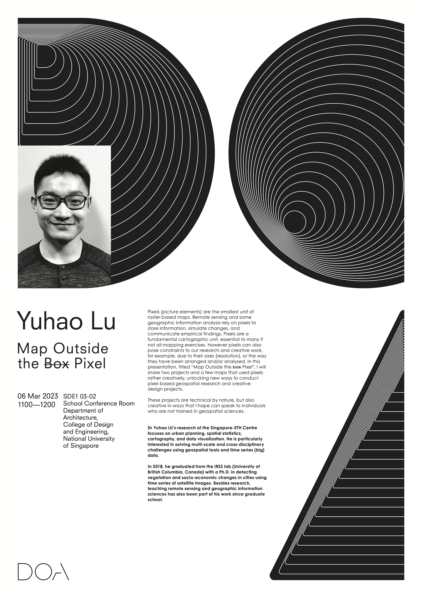
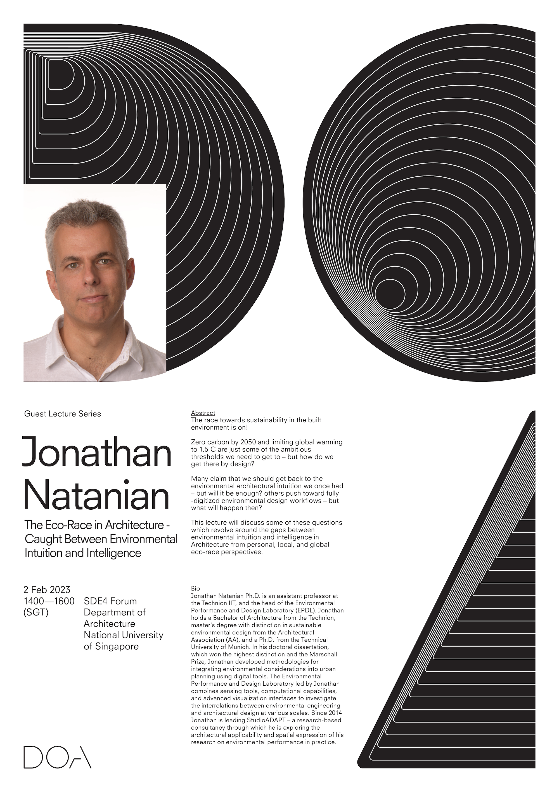
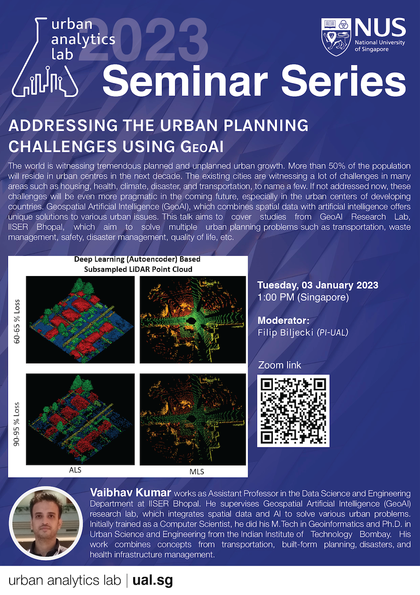
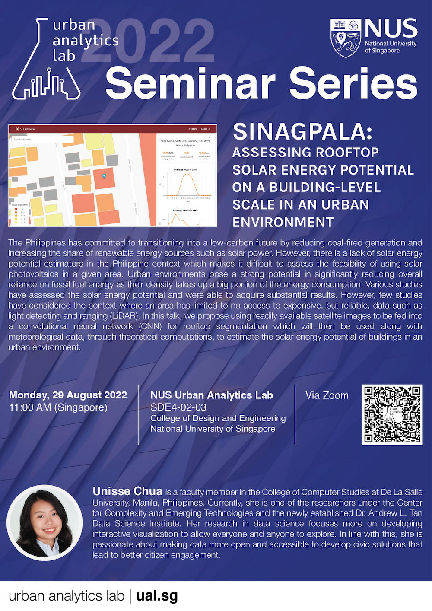
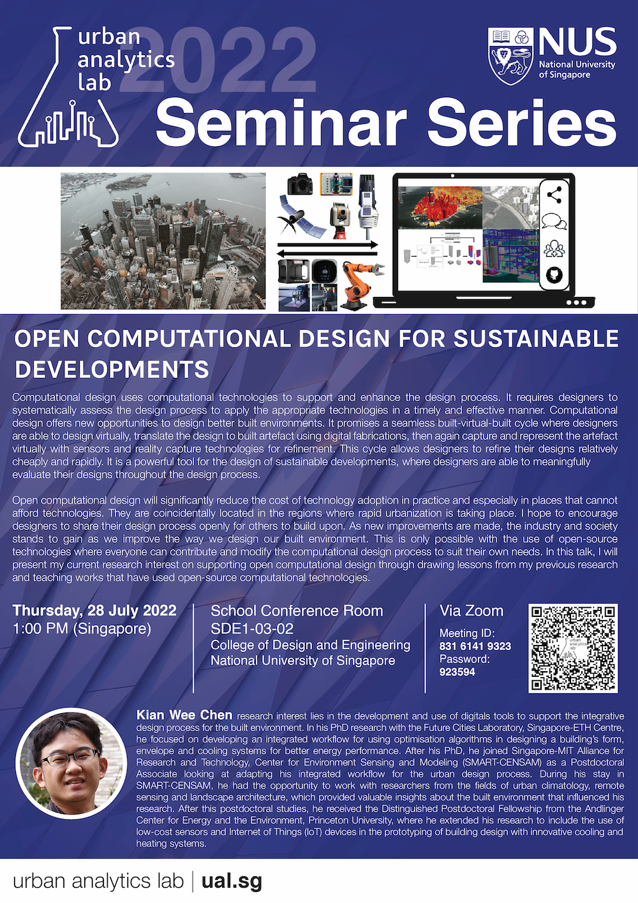
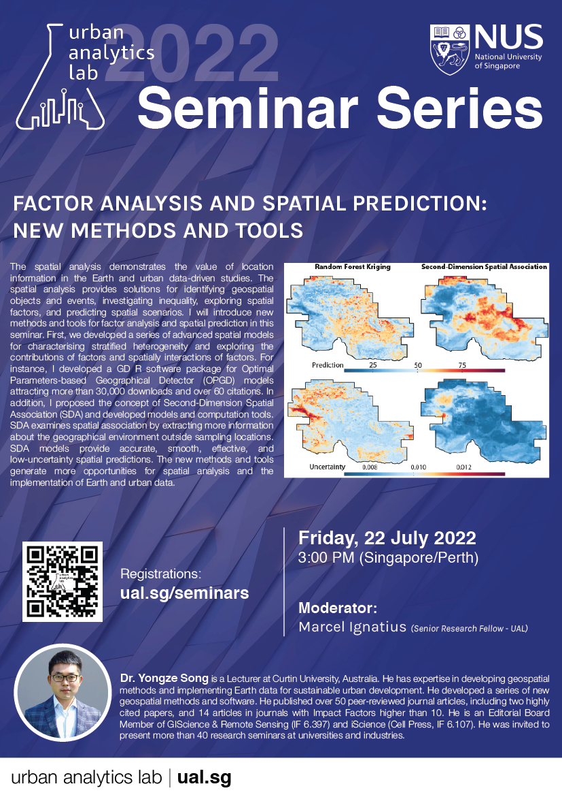
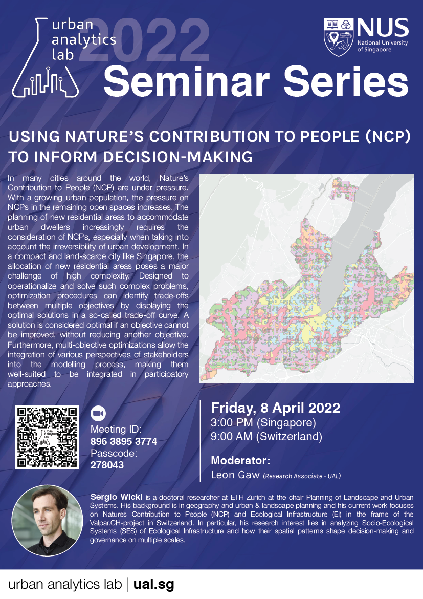

The Urban Analytics Lab seminar series is part of our community engagement and to provide a platform leading to discussions, new ideas, and spurring collaborations. 
In our series, we give priority to early career researchers to increase their visibility and learn about the latest cool ideas, but host seasoned researchers and professors as well.

Further, sometimes we organise guest lectures at the [department](https://cde.nus.edu.sg/arch/) level.
These are included below.
For the full list of events at our [NUS Department of Architecture](https://cde.nus.edu.sg/arch/) see the [list of events](https://cde.nus.edu.sg/arch/news_and_events/).

---

### 2024-05-13 --- Advancing Sense of Place with Human-centered Geospatial Data Science

By [Yuhao Kang](http://www.kkyyhh96.site/),
[Department of Geography](https://sc.edu/study/colleges_schools/artsandsciences/geography/index.php),
[University of South Carolina](https://sc.edu/),
USA

Human sense of place refers to how we perceive, experience, and interact with a particular location and environment. The emergence of Geospatial Data Science – the use of geographic knowledge and AI approaches to extract meaningful insights from large-scale geographic data – has achieved remarkable success not only in modeling physical geographic phenomena but also in advancing human subjective experiences at place. In this talk, Dr. Kang will present a series of works that utilize geospatial data science to understand human experience and sense of place. First, utilizing eye-tracking systems, his work delved into human subjective safety perceptions (e.g., whether a neighborhood is perceived as a safe place) to identify physical objects that attract human attention from street view images. Second, utilizing large language models (LLMs), his work proposed a Soundscape-to-Image Diffusion model to visualize and translate human auditory perceptions into visual representations of place. His work demonstrated how human multi-sensory experiences can be linked to comprehensively understand human sense of place using Generative AI. Finally, he will share his multifaceted experiences in GISphere that aim to promote global GIScience education.

---

### 2023-12-18 --- Opportunities and Challenges in Geospatial AI

By [Song Gao](https://geography.wisc.edu/staff/gao-song/),
[Geospatial Data Science Lab](https://geography.wisc.edu/geods/research),
[University of Wisconsin - Madison](https://www.wisc.edu),
USA

Geospatial artificial intelligence (GeoAI), an emerging interdisciplinary field, merges geographic knowledge with AI techniques to address significant scientific and engineering challenges in human-environmental systems. It focuses on enhancing machines’ spatial intelligence to improve dynamic perception, intelligent reasoning, knowledge discovery and mapping of geographic phenomena. This talk will introduce the historical roots of GeoAI, delve into the latest advancements in spatially explicit AI models, and examine innovative research and applications of GeoAI, as well as addressing some challenges associated with GeoAI foundation models.

---

### 2023-10-02 --- Realising Computational Design of Complex Geometry in Architecture

By [Ming Shan (Charmaine) Ng](https://www.hyokadb.jim.kit.ac.jp/profile/en.a8ad724387d2489b91764df21b29a00b.html),
[Center for the Possible Futures](https://www.cpf.kit.ac.jp),
[Kyoto Institute of Technology](https://www.kit.ac.jp/en/),
Japan

The talk showcases research and practice about computational design and digital fabrication of complex architecture. It explains how architects in Europe, America and Asia realised computational design of complex geometry building envelopes and structures with some of her past international projects in practice as examples. Dr. Ng introduces multiple key techniques in design practices, such as Design for Manufacture and Assembly (DfMA) and post-rationalisation through computational approaches, industrialised construction methods such as modularisation, prefabrication and digital fabrication, as well as integrated design management approaches such as lean-based Target Value Design, early contractor involvement, Integrated Project Delivery (IPD) and relational contracting. She also presents her research in correspondence to the above topics and demonstrates how scientific research can guide current practice to foster digital transformation, sustainability and circularity. Besides, she discusses her theoretical research on socio-technical network studies using the Actor-Network Theory (ANT) and transdisciplinary studies on liabilities and governance in technology implementation.

---

### 2023-09-18 --- Cities on the Climate Frontlines: Evaluating Urban Climate Change and Policy Responses

By [Angel Hsu](https://publicpolicy.unc.edu/person/hsu-angel/),
[Data-Driven EnviroLab](https://datadrivenlab.org), 
[The University of North Carolina at Chapel Hill](https://www.unc.edu/),
USA

Cities are both contributors and potential problem solvers of the global climate crisis. They are also vulnerable to climate change impacts, including sea-level rise, extreme heat, and natural disasters. Consequently, they have risen to become prominent climate and environmental sustainability agents, with the UN’s Sustainable Development Goal 11 charging cities to be both sustainable and inclusive and the Paris Agreement’s recognition of their contributions. In this talk, I’ll introduce how my research is utilizing data science to evaluate cities’ contributions to global climate mitigation efforts and urban sustainable development more broadly.

---

### 2023-08-07 --- Experiencing the Future of Cities through Virtual Reality

By [Gamze Dane](https://gamzedane.com),
[Department of Built Environment](https://www.tue.nl/en/our-university/departments/built-environment), 
[Eindhoven University of Technology](https://www.tue.nl/en/),
the Netherlands

To achieve sustainable, inclusive, and livable cities, it is necessary for citizens and urban planning stakeholders to efficiently experience, discuss, and comprehend the consequences of various alternative urban intervention scenarios. This process serves two key purposes: (i) enhancing the planning practice by fostering participation and communication among stakeholders and citizens, and (ii) facilitating informed decision-making in urban planning. To this end, Virtual Reality (VR) technology offers a promising solution by providing immersive and experiential tools that allow users to envision and explore the future of cities through simulated environments.
This presentation will showcase examples of projects where VR technology was utilized to
+ support participatory design processes. Through the development of an interactive immersive VR application, users were enabled to experience, create, and discuss different design options for healthy public space design.
+ gather data by tracking users’ behavior and choices within virtual environments that represent future urban scenarios. These insights are then used as input for agent-based models, which will predict the acceptance and use of future urban interventions.

---

### 2023-07-10 --- Sensing Cities with Street-level Imagery

By [Zhang Fan](https://www.ce.ust.hk/people/fan-zhang-zhangfan),
[Department of Civil and Environmental Engineering](https://www.ce.ust.hk), 
[Hong Kong University of Science and Technology](https://hkust.edu.hk),
Hong Kong SAR

The integration of digital technologies into the physical space has led to significant changes in our understanding, perception, design, and experience of cities. The advent of geospatial big data and advancements in AI have created new possibilities for sensing urban dynamics and evaluating the effects of urbanization.

One type of geospatial data that has attracted attention recently is street-level imagery, which enables urban physical environment to be observed from a human perspective. Recent developments in AI technologies have provided strong support for extracting semantic information from street-level imagery and quantifying urban physical environment, which not only observing urban physical environment from the human perspective, but also reveals human activities and socio-economic environments, providing new perspectives for the research on human-land relationships and spatial data mining and knowledge discovery.

This presentation will introduce case studies of street-level imagery under the framework of urban visual intelligence.

---

### 2023-04-12 --- Urban Analytics and Social Sensing

By [Wei Huang](https://huangweibuct.github.io/weihuang.github.io/),
[College of Surveying and Geo-Informatics](https://celiang.tongji.edu.cn/chinese/sy.htm),
[Tongji University](https://en.tongji.edu.cn/p/), 
China

Analyzing massive urban human behaviour datasets helps to quantitatively understand the complexity of urban systems and social networks, which can further provide evidence for urban planning and policy making towards urban sustainable development.
This talk reports data-driven models and applications for understanding the interactions between human activities and urban environments.

---

### 2023-04-10 --- Artificial Intelligence for accelerating low-carbon planning

By [Nikola Milojevic](https://milojevicdupontnikola.github.io),
[TU Berlin](https://www.susturbecon.tu-berlin.de/sustainability_economics_of_human_settlements/) and the [Mercator Research Institute on Global Commons and Climate Change](https://www.mcc-berlin.net/),
Germany

In this talk, I discuss the potential of geospatial data and AI to analyze cities in novel ways and provide insights that can help governments to take action on climate change.
I will introduce a framework that combines data sources, models and end goals, which I will exemplify by highlighting recent research of our group.

---

### 2023-03-06 --- Map Outside the ~~Box~~ Pixel

By [Yuhao Lu](https://fcl.ethz.ch/people/researchers/Yuhao-Lu.html),
[Future Cities Laboratory](https://fcl.ethz.ch), 
[Singapore-ETH Centre](https://sec.ethz.ch),
Singapore

Pixels (picture elements) are the smallest unit of raster-based maps.
Remote sensing and some geographic information analysis rely on pixels to store information, simulate changes, and communicate empirical findings.
Pixels are a fundamental cartographic unit, essential to many if not all mapping exercises.
However pixels can also pose constraints to our research and creative work, for example, due to their sizes (resolution), or the way they have been arranged and/or analysed. In this presentation, titled "Map Outside the ~~box~~ Pixel", I will share two projects and a few maps that used pixels rather creatively, unlocking new ways to conduct pixel-based geospatial research and creative design projects.
These projects are technical by nature, but also creative in ways that I hope can speak to individuals who are not trained in geospatial sciences.

---

### 2023-02-27 --- Urban shade planning for thermally sustainable cities: perspectives from multi-sensor analysis

By [Park Yujin](http://planning.cau.ac.kr/01_info/sub02_view.php?gubun=1&seq=600),
[Department of Urban Planning and Real Estate](http://planning.cau.ac.kr), 
[Chung-Ang University](https://www.cau.ac.kr/),
South Korea

Devising a nature- and design-based solution to combat climate challenges is a very important issue in urban planning to step up urban sustainability. Recent technological advances and the proliferation of big geospatial data allow for a more sophisticated digital representation of urban geometry in 3D. One underexplored but critical aspect is the impact of vertical urban features and their shading. Shading objects, including trees and buildings, are generally omnipresent in cities and can be utilized by urban planners to create effective local and regional plans for urban cooling. This talk addresses the interface of 3D land-use design and heat mitigation via diurnal shading, integrating geospatial analytics (3D GIS, spatial simulation and statistics) and remotely-sensed multi-resolution thermal data as a methodological tool. Based on a fine-resolution 3D model derived mainly from LiDAR, the relationship among land surface temperature, land cover composition, and shade characteristics are analyzed using statistical inference. The talk proposes challenges and research agendas that call for collaboration across domains (e.g. GIScience, energy, economics) to create sustainable land-use designs.

---

### 2023-02-02 --- The Eco-Race in Architecture Caught Between Environmental Intuition and Intelligence

By [Jonathan Natanian](https://jonathann.net.technion.ac.il),
[Faculty of Architecture and Town Planning](https://architecture.technion.ac.il), 
[Technion -- Israel Institute of Technology](http://www.technion.ac.il/en/),
Israel

The race towards sustainability in the built environment is on!
Zero carbon by 2050 and limiting global warming to 1.5 C are just some of the ambitious thresholds we need to get to -- but how do we get there by design?
Many claim that we should get back to the environmental architectural intuition we once had -- but will it be enough? others push toward fully-digitized environmental design workflows -- but what will happen then?
This lecture will discuss some of these questions which revolve around the gaps between environmental intuition and intelligence in Architecture from personal, local, and global eco-race perspectives.

---

### 2023-01-03 --- Addressing the Urban Planning Challenges Using GeoAI

By [Vaibhav Kumar](https://sites.google.com/view/vaibhavkumar1/home),
[Department of Data Science and Engineering](https://dse.iiserb.ac.in),
[Indian Institute of Science Education and Research Bhopal](https://www.iiserb.ac.in),
India

The world is witnessing tremendous planned and unplanned urban growth. More than 50% of the population will reside in urban centres in the next decade. The existing cities are witnessing a lot of challenges in many areas such as housing, health, climate, disaster, and transportation, to name a few. If not addressed now, these challenges will be even more pragmatic in the coming future, especially in the urban centers of developing countries. Geospatial Artificial Intelligence (GeoAI), which combines spatial data with artificial intelligence offers unique solutions to various urban issues. This talk aims to cover studies from GeoAI Research Lab, IISER Bhopal, which aim to solve multiple urban planning problems such as transportation, waste management, safety, disaster management, quality of life, etc.

---

### 2022-12-09 --- Computer Vision Applications in Planning Research

By [Meiqing Li](http://meiqingli.com),
[College of Environmental Design](https://ced.berkeley.edu),
[University of California, Berkeley](https://www.berkeley.edu),
USA

As planning research develops in response to a more complex policy context, better representation of the built environment (or physical urban system) at multiple scales becomes as important as a comprehensive and inclusive representation of decision-makers and processes. The emergence of novel data sources (e.g., OpenStreetMap, Google Street View, and satellite imagery) allows researchers to extract higher quality measures of the built environment, addressing some of the limitations in previous research regarding spatial-temporal data quality and consistency. Computer science technologies, especially computer vision, present opportunities to advance traditional data collection techniques by extracting built environment features beyond regional scales and network resolution. This seminar will discuss a few recent and ongoing projects integrating computer vision technologies into the pipeline of planning research. 

---

### 2022-11-25 --- The role of digital tools and data for citizen engagement and participatory planning

By [Gamze Dane](https://gamzedane.com),
[Department of Built Environment](https://www.tue.nl/en/our-university/departments/built-environment/),
[Eindhoven University of Technology](https://www.tue.nl/en/),
& Digital City Program at the [Urban Development Initiative](https://brainporteindhoven.com/udi/en/),
the Netherlands

As a response to centralized and rationalistic urban planning approaches that are unresponsive to citizens’ needs, participatory planning methods have emerged to design and plan urban environments with people for people. In recent years, there has been a rapid increase in the design, use, and adoption of digital tools (i.e. digital twins, VR, information dashboards) and the produced data (i.e. digital tracking, social media data, big data from sensory experiences) for supporting participatory decision-making in urban planning. These technologies assist citizen engagement and participatory planning in order to understand the status quo in urban areas, communicate potential changes, co-design future urban areas and reach consensus for inclusive, livable and sustainable urban environments. In this talk, I will present my current research interests in digital participatory planning. The presentation will cover the topics of (i) developing and applying digital tools and citizen science methods for supporting public participation and citizen engagement in urban transformation processes, (ii) performing urban (big) data science within people as sensors concept for understanding and predicting citizens’ behavior, opinions and experiences towards urban interventions.

---

### 2022-08-29 --- Sinagpala: Assessing Rooftop Solar Energy Potential on a Building-level Scale in an Urban Environment

By
[Unisse Chua](https://unissechua.github.io),
[Center for Complexity and Emerging Technologies](https://comet.dlsu.edu.ph),
[College of Computer Studies](https://www.dlsu.edu.ph/colleges/ccs/),
[De La Salle University](https://www.dlsu.edu.ph/),
the Philippines

The Philippines has committed to transitioning into a low-carbon future by reducing coal-fired generation and increasing the share of renewable energy sources such as solar power. However, there is a lack of solar energy potential estimators in the Philippine context which makes it difficult to assess the feasibility of using solar photovoltaics in a given area. Urban environments pose a strong potential in significantly reducing overall reliance on fossil fuel energy as their density takes up a big portion of the energy consumption. Various studies have assessed the solar energy potential and were able to acquire substantial results. However, few studies have considered the context where an area has limited to no access to expensive, but reliable, data such as light detecting and ranging (LiDAR). In this talk, we propose using readily available satellite images to be fed into a convolutional neural network (CNN) for rooftop segmentation which will then be used along with meteorological data, through theoretical computations, to estimate the solar energy potential of buildings in an urban environment.

---

### 2022-07-28 --- Open Computational Design for Sustainable Developments (in person at NUS + online)

By
[Kian Wee Chen](https://acee.princeton.edu/people-directory/kian-wee-chen/),
[CHAOS Lab](https://chaos.princeton.edu),
[Andlinger Center for Energy and the Environment](https://acee.princeton.edu),
Princeton University,
USA

Computational design uses computational technologies to support and enhance the design process. It requires designers to systematically assess the design process to apply the appropriate technologies in a timely and effective manner. Computational design offers new opportunities to design better built environments. It promises a seamless built-virtual-built cycle where designers are able to design virtually, translate the design to built artefact using digital fabrications, then again capture and represent the artefact virtually with sensors and reality capture technologies for refinement. This cycle allows designers to refine their designs relatively cheaply and rapidly. It is a powerful tool for the design of sustainable developments, where designers are able to meaningfully evaluate their designs throughout the design process.
Open computational design will significantly reduce the cost of technology adoption in practice and especially in places that cannot afford technologies. They are coincidentally located in the regions where rapid urbanization is taking place. I hope to encourage designers to share their design process openly for others to build upon. As new improvements are made, the industry and society stands to gain as we improve the way we design our built environment. This is only possible with the use of open-source technologies where everyone can contribute and modify the computational design process to suit their own needs. In this talk, I will present my current research interest on supporting open computational design through drawing lessons from my previous research and teaching works that have used open-source computational technologies.

---

### 2022-07-22 --- Factor Analysis and Spatial Prediction: New Methods and Tools

By
[Yongze Song](https://yongzesong.com),
[School of Design and the Built Environment](https://about.curtin.edu.au/learning-teaching/humanities/design-built-environment/),
Curtin University,
Australia

The spatial analysis demonstrates the value of location information in the Earth and urban data-driven studies. The spatial analysis provides solutions for identifying geospatial objects and events, investigating inequality, exploring spatial factors, and predicting spatial scenarios. I will introduce new methods and tools for factor analysis and spatial prediction in this seminar. First, we developed a series of advanced spatial models for characterising stratified heterogeneity and exploring the contributions of factors and spatially interactions of factors. For instance, I developed a GD R software package for Optimal Parameters-based Geographical Detector (OPGD) models attracting more than 30,000 downloads and over 60 citations. In addition, I proposed the concept of Second-Dimension Spatial Association (SDA) and developed models and computation tools. SDA examines spatial association by extracting more information about the geographical environment outside sampling locations. SDA models provide accurate, smooth, effective, and low-uncertainty spatial predictions. The new methods and tools generate more opportunities for spatial analysis and the implementation of Earth and urban data.

---

### 2022-04-29 --- Deep learning from Volunteered Geographical Information: a case study of humanitarian mapping with OpenStreetMap

By
[Hao Li](https://bobleegogogo.github.io),
[GIScience Research Group](https://www.geog.uni-heidelberg.de/gis/index_en.html),
Heidelberg University,
Germany

As an emerging topic, OpenStreetMap (OSM) has been greatly improved via recent humanitarian mapping campaigns, and intensively used to support humanitarian aid activities, especially in sub-Saharan Africa. Considering its time-crucial nature, how to create timely and accurate maps of OSM missing features (e.g., buildings and roads) become a vital challenge. In our project DeepVGI, we study predictive analytics methods with remote sensing images, VGI, and social media data (e.g., Twitter) via advanced deep learning algorithms. The experiments results, especially in sub-Saharan Africa countries, demonstrate the capability of GeoAI in improving the OSM data completeness, and more importantly show great potential in supporting better and faster humanitarian mapping from a machine-assisted mapping perspective.

---

### 2022-04-08 --- Using nature's contribution to people (NCP) to inform decision-making

By
[Sergio Wicki](https://irl.ethz.ch/people/person-detail.MTY4ODA4.TGlzdC8xNzM4LC0xMzk1OTgzMDM3.html),
[Planning of Landscape and Urban Systems](https://plus.ethz.ch),
ETH Zurich,
Switzerland

In many cities around the world. Nature's Contribution to People (NCP) are under pressure.
With a growing urban population, the pressure on NCPs in the remaining open spaces increases.
The planning of new residential areas to accommodate urban dwellers increasingly requires the consideration of NCPs, especially when taking into account the irreversibility of urban development.
In a compact and land-scarce city like Singapore, the allocation of new residential areas poses a major challenge of high complexity.
Designed to operationalize and solve such complex problems, optimization procedures can identify trade-offs between multiple objectives by displaying the optimal solutions in a so-called trade-off curve.
A solution is considered optimal if an objective cannot be improved, without reducing another objectve.
Furthermore, multi-objective optimizations allow the integration of various perspectives of stakeholders into the modeling process, making them well-suited to be integrated in participatory approaches.

---

### 2022-03-11 --- 3D building metrics for urban morphology

By [Anna Labetski](http://3d.bk.tudelft.nl/alabetski) and [Stelios Vitalis](http://3d.bk.tudelft.nl/svitalis),
[3D Geoinformation group](https://3d.bk.tudelft.nl),
Delft University of Technology,
the Netherlands

The study of urban morphology is a well established field for
understanding the impact and the management of the urban form and
the built environment which is useful in many different applications. While
there have been a plethora of studies in 2D, there have been very little in
3D, of which a vast majority are not in fact true 3D and rather 2.5D. Our
work aims to project urban morphology analysis to true 3D. This work is
driven in large part due to the availability of open 3D city models as well
as new 3D Python libraries. In our presentation we will examine 3D urban
morphology metrics, the process of moving from 2D to 3D, difficulties in
working with 3D data, and applications that can benefit from this
analvsis.

